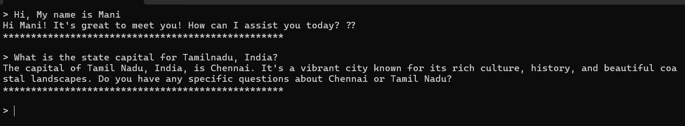
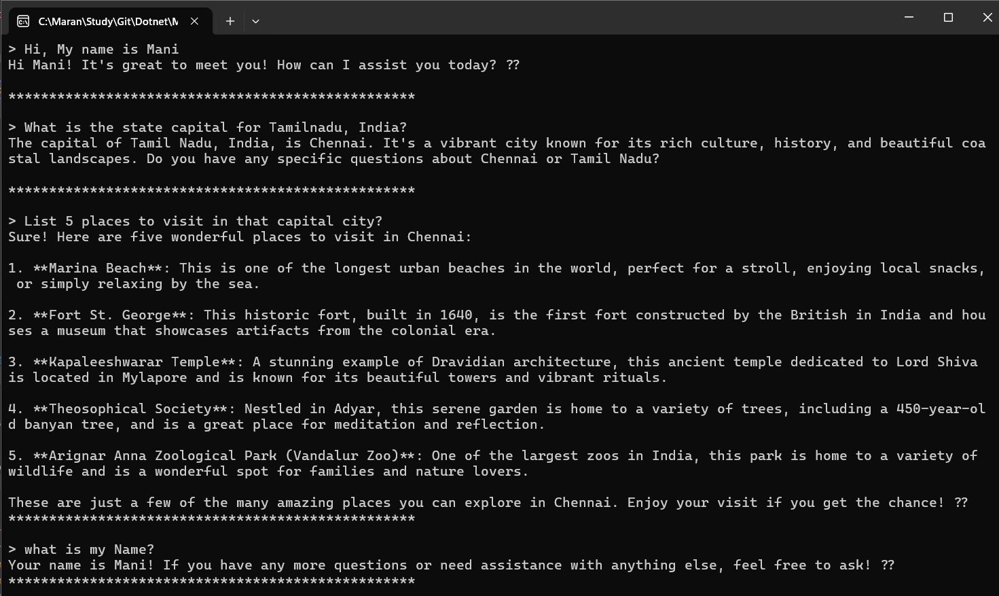
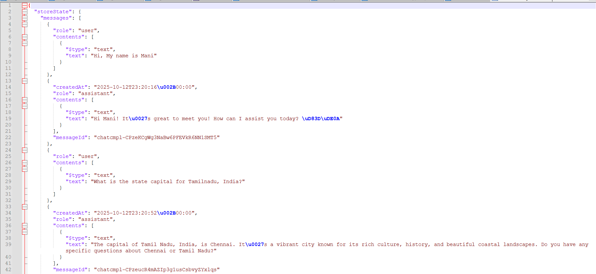

# Persistent Conversation with Microsoft Agents Framework

This project demonstrates how to implement persistent conversation functionality using the Microsoft Agents Framework with Azure OpenAI. The application maintains conversation history across sessions by serializing and deserializing agent threads.

## Features

- **Persistent Conversations**: Save and restore chat history across application restarts
- **Azure OpenAI Integration**: Uses Azure OpenAI services for AI responses
- **Thread Management**: Implements agent thread serialization/deserialization
- **Console Interface**: Interactive command-line chat experience
- **Configuration Management**: Supports both appsettings.json and user secrets

## Project Structure

```
03-PersistentConversation/
├── ConsoleApp/                    # Main console application
│   ├── Program.cs                 # Entry point and main chat loop
│   ├── AgentThreadPersistence.cs  # Thread persistence logic
│   ├── LLMConfig.cs              # Configuration management
│   └── ConsoleApp.csproj         # Project file
├── SharedLib/                     # Shared utilities
│   ├── Utils.cs                  # Console utility methods
│   └── Extensions/               # Extension methods
└── README.md                     # This file
```

## Key Components

### AgentThreadPersistence
Handles saving and loading conversation threads:
- Stores conversations as JSON in temp directory
- Prompts user to restore previous conversations
- Restores console display with conversation history

### Program.cs
Main application flow:
- Creates Azure OpenAI client and AI agent
- Manages conversation loop
- Handles user input and streaming responses

## Configuration

Configure Azure OpenAI settings in `appsettings.json` or user secrets:

```json
{
  "AzureAI": {
    "Endpoint": "your-azure-openai-endpoint",
    "ApiKey": "your-api-key",
    "ModelId": "gpt-4o"
  }
}
```

## Dependencies

- Microsoft.Agents.AI.OpenAI (1.0.0-preview.251007.1)
- Microsoft.Agents.AI.Workflows (1.0.0-preview.251009.1)
- Azure.AI.OpenAI (2.1.0)
- Microsoft.Extensions.Configuration (9.0.9)

## Usage

1. Configure your Azure OpenAI credentials
2. Run the console application
3. If a previous conversation exists, choose to restore it
4. Start chatting with the AI agent
5. Conversations are automatically saved after each interaction

## Screenshots


**Initial conversation**


**Reloading conversation and asking question**


**conversation.json**

## How It Works

1. **Thread Creation**: Creates a new `AgentThread` or restores from saved JSON
2. **Conversation Loop**: Processes user input and streams AI responses
3. **Persistence**: Serializes thread state to JSON after each interaction
4. **Restoration**: Deserializes saved thread and replays conversation history

The conversation data is stored in the system temp directory as `conversation.json`, containing the complete thread state including message history and metadata.