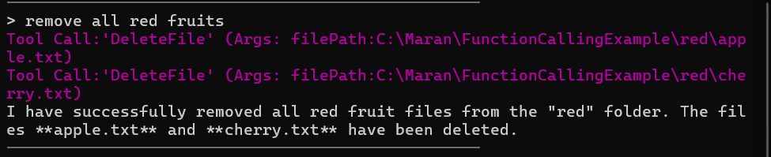

# Tool Calling with Microsoft Agent Framework

## What is Tool Calling?

**Tool Calling** (also known as Function Calling) is a powerful feature that allows AI agents to interact with external systems, APIs, and perform specific actions beyond just generating text responses. Instead of being limited to conversational responses, AI agents can now:

- Execute functions in your application
- Access databases and APIs
- Perform file operations
- Make calculations
- Interact with external services

Think of it as giving your AI agent "hands" to actually do things, not just talk about them.

## How Tool Calling Works

1. **Define Tools**: You create functions that the AI can call
2. **Register Tools**: You tell the AI agent what tools are available
3. **AI Decision**: The AI decides when and how to use these tools based on user requests
4. **Function Execution**: The AI calls the appropriate function with the right parameters
5. **Response Integration**: The AI incorporates the function results into its response

## Project Structure

This project demonstrates two approaches to tool calling:

```
04-ToolCalling/
├── ToolCalling.Basic/          # Simple tool calling examples
│   ├── Program.cs              # Basic agent setup
│   ├── Tools.cs                # Time-related tools
│   └── AIConfig.cs             # Configuration
├── ToolCalling.Advanced/       # Advanced tool calling features
│   ├── Program.cs              # Advanced agent with middleware
│   ├── FileSystemTools.cs      # File system operations
│   ├── DangerousTools.cs       # Tools requiring approval
│   └── Extensions/             # Custom extensions
└── README.md                   # This file
```

## Basic Tool Calling Example

### Simple Time Tools

The basic example shows how to create simple tools that provide time information:

```csharp
public static class Tools
{
    [Description("Get the current date and time in the specified timezone.")]
    public static DateTime CurrentDateAndTime(TimeType type)
    {
        return type switch
        {
            TimeType.Local => DateTime.Now,
            TimeType.Utc => DateTime.UtcNow,         
            _ => throw new ArgumentOutOfRangeException(nameof(type), type, null)
        };
    }

    [Description("Get the current timezone of the system.")]
    public static string CurrentTimezone()
    {
        return TimeZoneInfo.Local.DisplayName;
    }
}
```

### Key Concepts in Basic Example:

- **Description Attribute**: Helps the AI understand what each tool does
- **Typed Parameters**: The AI can pass specific parameter types (like enums)
- **Return Values**: Tools can return data that the AI incorporates into responses

## Advanced Tool Calling Example

### File System Operations

The advanced example demonstrates more complex scenarios:

```csharp
public class FileSystemTools
{
    public void CreateFile(string filePath, string fileContent) { ... }
    public string GetFileContent(string filePath) { ... }
    public void MoveFile(string sourceFilePath, string destinationFilePath) { ... }
    public void DeleteFile(string filePath) { ... }
    // ... more file operations
}
```

### Advanced Features:

1. **Security Guards**: Prevents operations outside designated folders
2. **User Approval**: Dangerous operations require user confirmation
3. **Middleware**: Logs function calls and handles approvals
4. **Reflection-based Registration**: Automatically discovers and registers tools

## Screenshots Walkthrough

The project includes several screenshots showing the tool calling in action:


*Basic time tool demonstration*


*File system operations with AI agent*


*File sytem operations - create files*


*File sytem operations - create folder and move files*


*File sytem operations - Files moved*


*Proper error handling in tool execution*


*Multi-step operations using multiple tools*


*Performing Dangerous operation with approval - yes*


*Performing Dangerous operation with approval - no*


*FIle Operation with Middleware and Token usage details*

## Getting Started

### Prerequisites

- .NET 9.0 or later
- Azure OpenAI API key and endpoint
- Visual Studio 2022 or VS Code

### Setup

1. **Clone the repository**
2. **Configure AI settings** in `appsettings.json`:
   ```json
   {
     "AzureOpenAI": {
       "Endpoint": "your-endpoint-here",
       "ApiKey": "your-api-key-here",
       "DeploymentName": "your-model-deployment"
     }
   }
   ```

3. **Run the basic example**:
   ```bash
   cd ToolCalling.Basic
   dotnet run
   ```

4. **Try the advanced example**:
   ```bash
   cd ToolCalling.Advanced
   dotnet run
   ```

### Example Interactions

**Basic Example:**
```
> What time is it?
AI: Let me check the current time for you...
[Calls CurrentDateAndTime tool]
The current local time is 2024-01-15 14:30:25

> What's my timezone?
AI: [Calls CurrentTimezone tool]
You're in (UTC-05:00) Eastern Time (US & Canada)
```

**Advanced Example:**
```
> Create a file called "hello.txt" with content "Hello World"
AI: I'll create that file for you...
[Calls CreateFile tool]
File created successfully at C:\Maran\FunctionCallingExample\hello.txt

> What files are in the folder?
AI: [Calls GetFiles tool]
The folder contains: hello.txt
```

**MCP Tool call**


## Key Benefits

1. **Extended Capabilities**: AI can perform real actions, not just provide information
2. **Natural Interaction**: Users can request actions in natural language
3. **Safety**: Built-in security measures and approval workflows
4. **Flexibility**: Easy to add new tools and capabilities
5. **Integration**: Seamlessly combines AI reasoning with system operations

## Best Practices

1. **Clear Descriptions**: Use descriptive attributes to help AI understand tool purposes
2. **Parameter Validation**: Always validate inputs in your tools
3. **Security First**: Implement guards and approval mechanisms for sensitive operations
4. **Error Handling**: Provide meaningful error messages
5. **Logging**: Track tool usage for debugging and monitoring

## Common Use Cases

- **File Management**: Create, read, update, delete files and folders
- **Data Processing**: Query databases, process CSV files, generate reports
- **API Integration**: Call external APIs, fetch data from web services
- **System Operations**: Check system status, manage processes
- **Calculations**: Perform complex mathematical operations
- **Automation**: Automate repetitive tasks and workflows

## Troubleshooting

- **Tool Not Called**: Check function descriptions and parameter types
- **Permission Errors**: Verify security guards and file permissions
- **API Errors**: Confirm Azure OpenAI configuration
- **Token Limits**: Monitor token usage for complex operations

This project demonstrates the power of combining AI reasoning with practical system capabilities, enabling truly intelligent and actionable AI assistants.