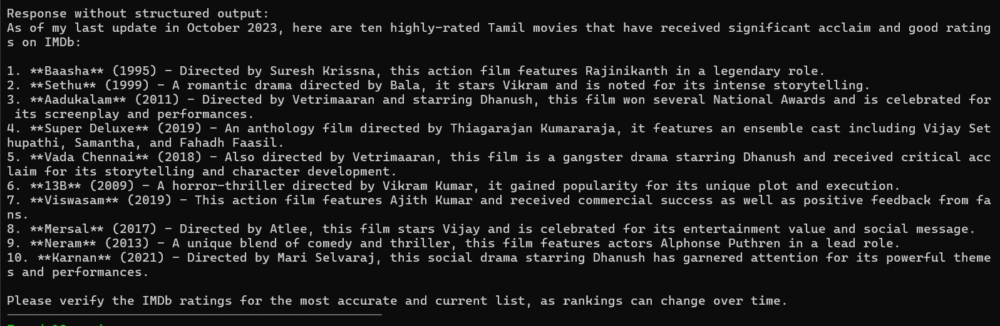
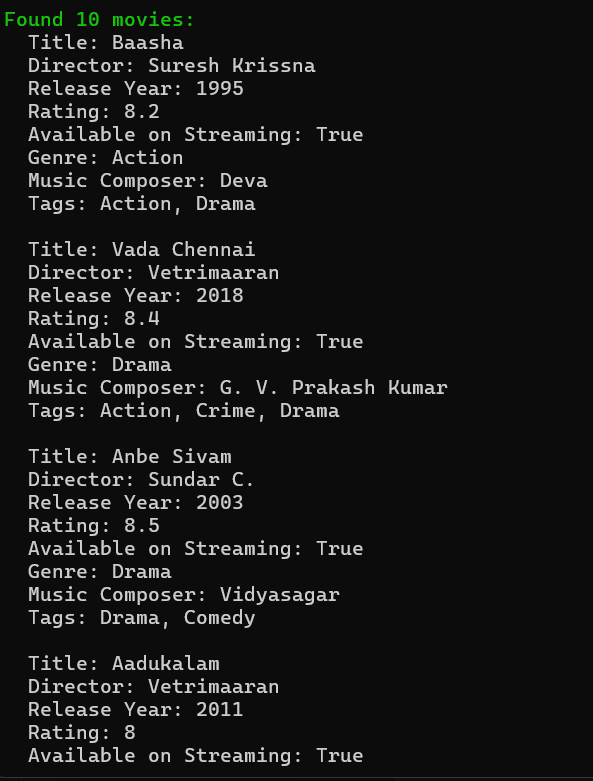

# Structured Output with Microsoft Agent Framework

This project demonstrates how to use structured output with the Microsoft Agent Framework and Azure OpenAI to get consistent, typed responses from AI agents.

## Overview

The application shows three different approaches to getting structured data from AI agents:
1. **Basic Agent Response** - Standard text response without structure
2. **Typed Agent Response** - Using generic `RunAsync<T>()` method for structured output
3. **JSON Schema Response** - Using explicit JSON schema formatting with custom serialization options

## Features

- Demonstrates structured output using Microsoft Agent Framework
- Shows comparison between unstructured and structured AI responses
- Implements custom JSON serialization options
- Uses Azure OpenAI GPT-4o model
- Includes proper error handling and configuration management

## Project Structure

```
06-StructuredOutput/
├── AgentApp/                 # Main console application
│   ├── Models/
│   │   └── Movie.cs         # Movie data models and enums
│   ├── Program.cs           # Main application logic
│   ├── LLMConfig.cs         # Configuration management
│   └── appsettings.json     # Application settings
├── SharedLib/               # Shared utilities library
│   └── Utils.cs            # Console output utilities
└── README.md               # This file
```

## Models

### Movie
Represents a movie with properties:
- Title, Director, Release Year, Rating
- Streaming availability, Genre, Music Composer
- Tags collection

### Genre Enum
Supports: Action, Comedy, Drama, Horror, SciFi, Romance, Documentary, Thriller, Animation, Fantasy

## Setup

1. **Configure Azure OpenAI**:
   - Update `appsettings.json` with your Azure OpenAI endpoint
   - Set API key using User Secrets or environment variables

2. **Install Dependencies**:
   ```bash
   dotnet restore
   ```

3. **Run the Application**:
   ```bash
   dotnet run --project AgentApp
   ```

## Configuration

The application uses configuration from:
- `appsettings.json` - Base configuration
- User Secrets - Secure API key storage

Required settings:
```json
{
  "AzureAI": {
    "Endpoint": "https://your-openai-endpoint.openai.azure.com/",
    "ApiKey": "your-api-key",
    "ModelId": "gpt-4o"
  }
}
```

## Key Dependencies

- Microsoft.Agents.AI.OpenAI (1.0.0-preview.251007.1)
- Azure.AI.OpenAI (2.1.0)
- Microsoft.Extensions.Configuration (9.0.9)
- .NET 9.0

## Usage Example

The application queries for "top 10 Tamil movies in IMDB" and demonstrates three response formats:

1. **Unstructured**: Plain text response
2. **Structured Generic**: Typed `MovieResult` object
3. **JSON Schema**: Custom serialized structured response

Each approach shows different levels of control over the AI response format and parsing.

### Screenshots



