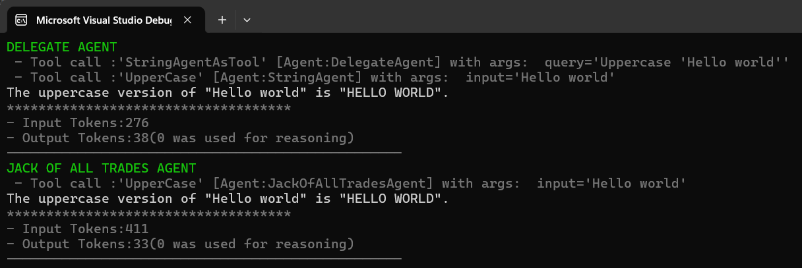
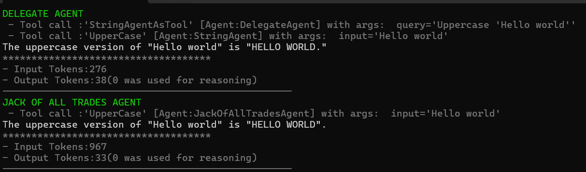

# Agent Calling Agent - Multi-Agent System Demo

This project demonstrates how to create a multi-agent system using Microsoft Agent Framework where agents can call other agents as tools. It showcases two different approaches:

1. **Delegation Pattern**: A delegate agent that routes tasks to specialized agents
2. **Jack-of-All-Trades Pattern**: A single agent with all tools available

## Project Structure

```
07-AgentCallingAgent/
├── MultiAgent/                 # Main console application
│   ├── Tools/                  # Tool implementations
│   │   ├── StringTools.cs      # String manipulation tools
│   │   └── NumericTools.cs     # Numeric operation tools
│   ├── Extensions/             # Extension methods
│   │   └── UsageExtensions.cs  # Token usage tracking
│   ├── Program.cs              # Main application entry point
│   ├── LLMConfig.cs           # Configuration management
│   └── appsettings.json       # Configuration file
├── SharedLib/                  # Shared utilities
│   └── Utils.cs               # Console output utilities
└── README.md                  # This file
```

## Features

### String Tools
- **Reverse**: Reverses a string
- **UpperCase**: Converts string to uppercase
- **LowerCase**: Converts string to lowercase

### Numeric Tools
- **Add**: Adds two numbers
- **Subtract**: Subtracts two numbers
- **Multiply**: Multiplies two numbers
- **Divide**: Divides two numbers (with zero-division protection)
- **RandomNumber**: Generates random number within range
- **AnswerToEverything**: Returns 42 (Douglas Adams reference)

## Prerequisites

- **.NET 9.0 SDK** or later
- **Azure OpenAI Service** account with API access
- **Visual Studio 2022** or **Visual Studio Code** (recommended)

## Setup Instructions

### 1. Clone and Navigate
```bash
git clone <repository-url>
cd 07-AgentCallingAgent
```

### 2. Configure Azure OpenAI

Update `MultiAgent/appsettings.json` with your Azure OpenAI credentials:

```json
{
  "AzureAI": {
    "Endpoint": "https://your-resource.openai.azure.com/",
    "ApiKey": "your-api-key-here",
    "ModelId": "gpt-4o"
  }
}
```

**Security Note**: For production, use User Secrets instead of storing API keys in appsettings.json:

```bash
cd MultiAgent
dotnet user-secrets set "AzureAI:ApiKey" "your-api-key-here"
dotnet user-secrets set "AzureAI:Endpoint" "https://your-resource.openai.azure.com/"
```

### 3. Build the Solution
```bash
dotnet build
```

### 4. Run the Application
```bash
cd MultiAgent
dotnet run
```

## How It Works

### Agent Architecture

The application creates three types of agents:

1. **StringAgent**: Specialized in string manipulation
2. **NumberAgent**: Specialized in numeric operations
3. **DelegateAgent**: Routes tasks to appropriate specialized agents
4. **JackOfAllTradesAgent**: Has access to all tools directly

### Delegation Pattern vs Direct Access

The project compares two approaches:

**Delegation Pattern**:
- Delegate agent receives user request
- Analyzes the task type
- Calls appropriate specialized agent
- Returns the result

**Direct Access Pattern**:
- Single agent has all tools available
- Directly selects and uses appropriate tools
- No intermediate agent calls

## Sample Output






## Key Code Concepts

### Creating Agents with Tools
```csharp
AIAgent stringAgent = client.GetChatClient(LLMConfig.DeploymentOrModelId)
    .CreateAIAgent(
        name: "StringAgent",
        instructions: "You are a string manipulator",
        tools: [
            AIFunctionFactory.Create(StringTools.Reverse),
            AIFunctionFactory.Create(StringTools.UpperCase),
            AIFunctionFactory.Create(StringTools.LowerCase)
        ])
    .AsBuilder()
    .Use(FunctionCallMiddleware)
    .Build();
```

### Using Agents as Tools
```csharp
AIAgent delegationAgent = client.GetChatClient(LLMConfig.DeploymentOrModelId)
    .CreateAIAgent(
        name: "DelegateAgent",
        instructions: "You delegate tasks to specialized agents",
        tools: [
            stringAgent.AsAIFunction(new AIFunctionFactoryOptions {
                Name = "StringAgentAsTool"
            }),
            numericAgent.AsAIFunction(new AIFunctionFactoryOptions {
                Name = "NumberAgentAsTool"
            })
        ])
    .Build();
```

### Function Call Middleware
The middleware tracks function calls and provides detailed logging:
```csharp
async ValueTask<object?> FunctionCallMiddleware(
    AIAgent callingAgent, 
    FunctionInvocationContext context,
    Func<FunctionInvocationContext, CancellationToken, ValueTask<object?>> next,
    CancellationToken cancellationToken = default)
{
    // Log function call details
    Utils.WriteLineInformation($"Tool call: '{context.Function.Name}' [Agent:{callingAgent.Name}]");
    return await next(context, cancellationToken);
}
```

## Understanding the Output

The application demonstrates:
- **Function call tracing**: See which agent calls which tools
- **Token usage tracking**: Compare efficiency between patterns
- **Reasoning token usage**: Track tokens used for internal reasoning
- **Performance comparison**: Delegation vs direct access patterns

## Customization

### Adding New Tools
1. Create a new static method in `StringTools.cs` or `NumericTools.cs`
2. Add the tool to the appropriate agent using `AIFunctionFactory.Create()`

### Modifying Agent Instructions
Update the `instructions` parameter when creating agents to change their behavior.

### Adding New Agents
Create new specialized agents following the existing pattern and add them to the delegation agent's tools.

## Troubleshooting

### Common Issues

1. **API Key Error**: Ensure your Azure OpenAI API key is correctly set
2. **Endpoint Error**: Verify your Azure OpenAI endpoint URL
3. **Model Not Found**: Check that the specified model is deployed in your Azure OpenAI resource
4. **Build Errors**: Ensure .NET 9.0 SDK is installed

### Debug Tips

- Check the console output for detailed function call traces
- Monitor token usage to understand performance
- Use the middleware to track agent interactions

## Learning Objectives

This project helps you understand:
- Multi-agent system architecture
- Agent-to-agent communication patterns
- Tool integration with AI agents
- Performance comparison between different patterns
- Token usage optimization
- Middleware implementation for monitoring

## Next Steps

- Experiment with different agent instructions
- Add more complex tools and workflows
- Implement error handling and retry logic
- Explore async patterns for better performance
- Add logging and monitoring capabilities