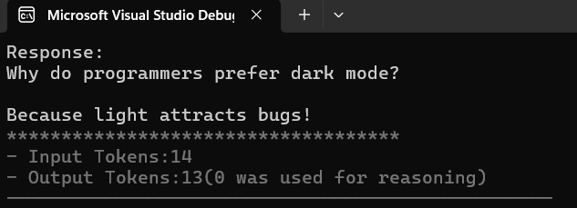
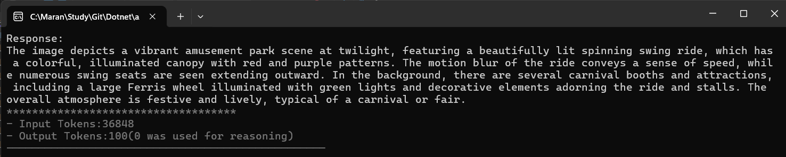
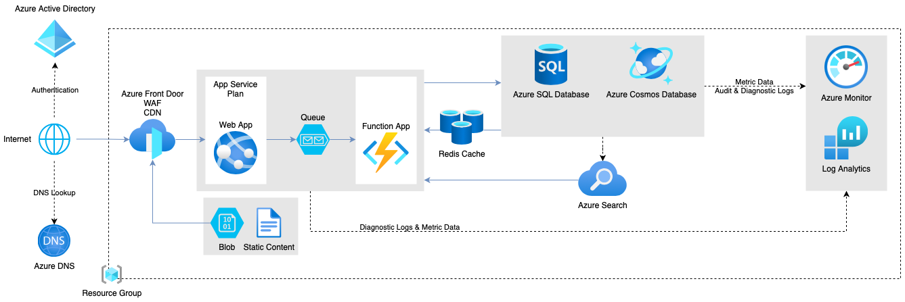
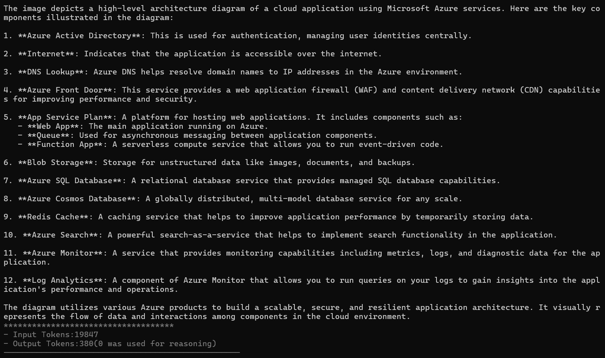
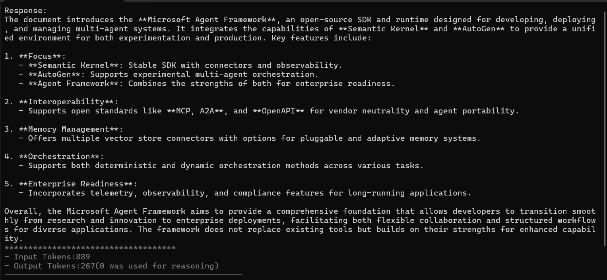

# Image and PDF Processing with Microsoft Agent Framework

This project demonstrates how to use the Microsoft Agent Framework to process images and PDF documents using Azure OpenAI and OpenAI services. The application can analyze images from URLs, local files, and summarize PDF documents.

## Features

- **Text Processing**: Basic text interaction with AI agents
- **Image Analysis**: Process images from multiple sources:
  - Remote URLs
  - Local files (Base64 encoding)
  - Memory-based data
- **PDF Summarization**: Extract and summarize content from PDF documents
- **Token Usage Tracking**: Monitor input/output token consumption

## Prerequisites

Before running this project, ensure you have:

1. **.NET 9.0 SDK** installed on your machine
2. **Azure OpenAI Service** account with API key and endpoint
3. **OpenAI API** key (for PDF processing)
4. **Visual Studio 2022** or **Visual Studio Code** (recommended)

## Project Structure

```
08-ImageAndPdf/
├── AgentApp/
│   ├── Program.cs              # Main application logic
│   ├── LLMConfig.cs           # Configuration management
│   ├── Utils.cs               # Utility functions and enums
│   ├── Extensions/            # Extension methods
│   ├── appsettings.json       # Configuration file
│   ├── AgentFramework.pdf     # Sample PDF for testing
│   └── azure-architecture-diagram.png # Sample image
└── README.md
```

## Setup Instructions

### Step 1: Clone and Navigate

```bash
git clone <repository-url>
cd 08-ImageAndPdf
```

### Step 2: Configure API Keys

1. Open `AgentApp/appsettings.json`
2. Replace the placeholder values with your actual API keys:

```json
{
  "AzureAI": {
    "Endpoint": "https://your-azure-openai-endpoint.openai.azure.com/",
    "ApiKey": "your-azure-openai-api-key",
    "ModelId": "gpt-4o"
  },
  "OpenAI": {
    "ApiKey": "your-openai-api-key"
  }
}
```

**Security Note**: For production, use User Secrets instead of storing keys in appsettings.json:

```bash
cd AgentApp
dotnet user-secrets set "AzureAI:ApiKey" "your-azure-openai-api-key"
dotnet user-secrets set "AzureAI:Endpoint" "your-azure-openai-endpoint"
dotnet user-secrets set "OpenAI:ApiKey" "your-openai-api-key"
```

### Step 3: Install Dependencies

```bash
cd AgentApp
dotnet restore
```

### Step 4: Build the Project

```bash
dotnet build
```

## Running the Application

### Option 1: Using .NET CLI

```bash
cd AgentApp
dotnet run
```

### Option 2: Using Visual Studio

1. Open `08-ImageAndPdf.sln` in Visual Studio
2. Set `AgentApp` as the startup project
3. Press F5 or click "Start Debugging"

## Usage Examples

The application demonstrates three scenarios that you can switch between by modifying the `scenario` variable in `Program.cs`:

### 1. Text Processing

```csharp
Scenario scenario = Scenario.Text;
```

**Sample Output:**


### 2. Image Analysis

```csharp
Scenario scenario = Scenario.Image;
```

This scenario processes images in three different ways:

#### Remote Image URL
Analyzes an image from a web URL:
```
Image URL: https://upload.wikimedia.org/wikipedia/commons/9/93/M%C3%BCnster%2C_Schlossplatz%2C_Herbstsend%2C_Kettenkarussell_--_2024_--_6459.jpg
```

**Sample Output:**


#### Local Image File
Processes the included architecture diagram:


**Sample Output:**


### 3. PDF Summarization

```csharp
Scenario scenario = Scenario.Pdf;
```

Summarizes the included `AgentFramework.pdf` document.

**Sample Output:**


## Key Components Explained

### Program.cs
- Main application entry point
- Demonstrates different content types (text, images, PDFs)
- Shows various ways to load and process images

### LLMConfig.cs
- Manages configuration loading from appsettings.json and user secrets
- Provides static access to API keys and endpoints

### Utils.cs
- Contains the `Scenario` enum for switching between different demos
- Provides colored console output utilities
- Includes token usage display helpers

## Important Notes

1. **Azure OpenAI vs OpenAI**: 
   - Azure OpenAI is used for text and image processing
   - OpenAI client is used for PDF processing (Azure OpenAI doesn't currently support PDF inputs)

2. **Image Formats Supported**: JPEG, PNG, and other common formats

3. **PDF Processing**: Only available through OpenAI client, not Azure OpenAI

4. **Token Usage**: The application tracks and displays input/output token consumption for cost monitoring

## Troubleshooting

### Common Issues

1. **API Key Errors**:
   - Verify your API keys are correct in appsettings.json or user secrets
   - Ensure your Azure OpenAI deployment name matches the ModelId

2. **File Not Found**:
   - Ensure sample files (PDF, images) are in the correct directory
   - Check that files are set to "Copy to Output Directory" in the project

3. **Network Issues**:
   - Verify internet connection for remote image URLs
   - Check firewall settings for API calls

### Getting Help

- Check the console output for detailed error messages
- Verify your API quotas and limits
- Ensure you're using compatible model versions

## Next Steps

- Experiment with different image URLs and local files
- Try different PDF documents
- Modify the prompts to ask different questions about images/PDFs
- Explore the token usage patterns for cost optimization

---

*This project is part of the Microsoft Agent Framework learning series, demonstrating multimodal AI capabilities with images and documents.*