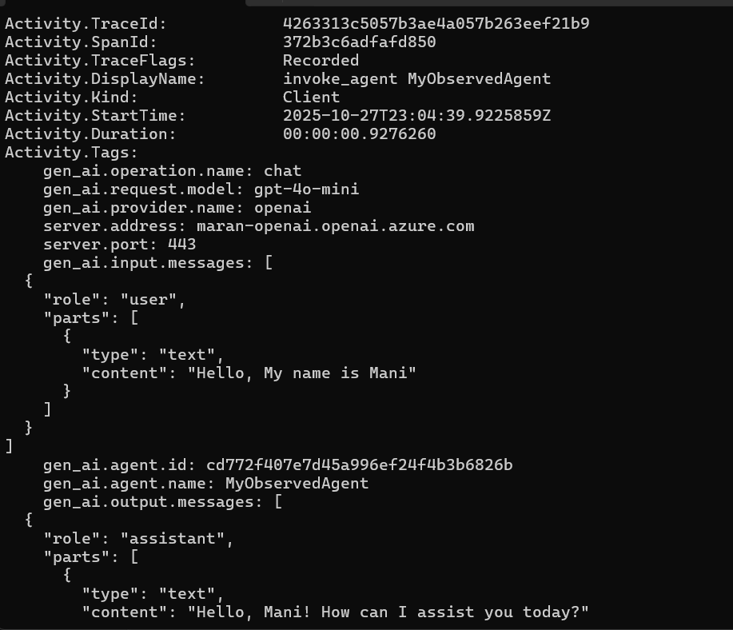
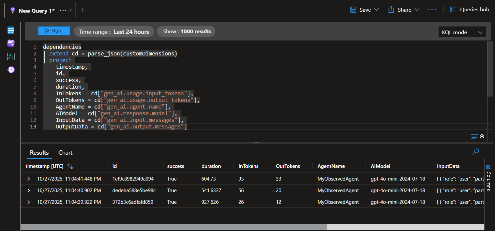

# AI Agent OpenTelemetry Exploration

This project demonstrates OpenTelemetry integration with Microsoft AI Agents, showcasing how to capture and analyze telemetry data from AI agent interactions.

## Overview

The project explores OpenTelemetry data collection when running AI Agents using the Microsoft Agents Framework. It demonstrates both console logging and Azure Application Insights integration for comprehensive observability.

## Project Structure

- **AIAgentTelemetry**: Main console application that creates and runs an AI agent with OpenTelemetry instrumentation
- **SharedLib**: Shared library containing configuration and utility classes

## Key Features

- OpenTelemetry tracing for AI agent operations
- Console telemetry output for local debugging
- Azure Application Insights integration for cloud-based monitoring
- Sensitive data logging capability for detailed analysis
- Multi-turn conversation tracking

## Configuration

Update `appsettings.json` with your Azure OpenAI and Application Insights details:

```json
{
  "AzureAI": {
    "Endpoint": "your-azure-openai-endpoint",
    "ApiKey": "your-api-key",
    "ModelId": "gpt-4o"
  },
  "ApplicationInsights": {
    "ConnectionString": "your-application-insights-connection-string"
  }
}
```

## Dependencies

- Azure.AI.OpenAI (2.5.0-beta.1)
- Microsoft.Agents.AI.OpenAI (1.0.0-preview.251016.1)
- OpenTelemetry (1.13.1)
- Azure.Monitor.OpenTelemetry.AspNetCore (1.4.0-beta.1)

## Usage

The application creates an AI agent with OpenTelemetry instrumentation and runs three sample interactions to demonstrate telemetry collection across a conversation thread.

### Console Telemetry Logs


### Application Insights Analysis

Query to analyze AI agent telemetry data in Application Insights:

```kusto
dependencies
| extend cd = parse_json(customDimensions)
| project 
    timestamp, 
    id, 
    success, 
    duration, 
    InTokens = cd["gen_ai.usage.input_tokens"],
    OutTokens = cd["gen_ai.usage.output_tokens"],
    AgentName = cd["gen_ai.agent.name"], 
    AIModel = cd["gen_ai.response.model"], 
    InputData = cd["gen_ai.input.messages"], 
    OutputData = cd["gen_ai.output.messages"]
```



## Telemetry Data Captured

- **Token Usage**: Input and output token counts for cost analysis
- **Agent Information**: Agent name and AI model used
- **Conversation Data**: Complete input/output message history
- **Performance Metrics**: Request duration and success status
- **Tracing**: Distributed tracing across agent operations