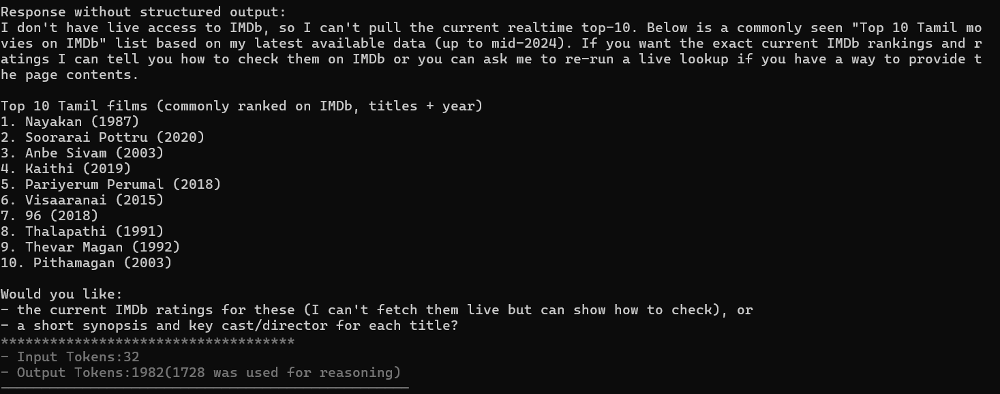
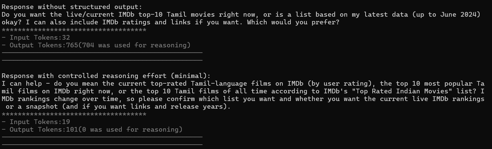
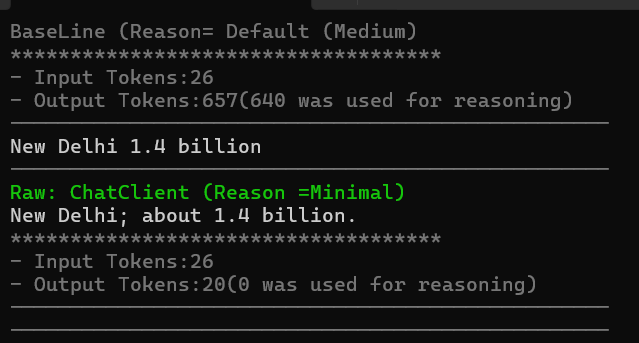
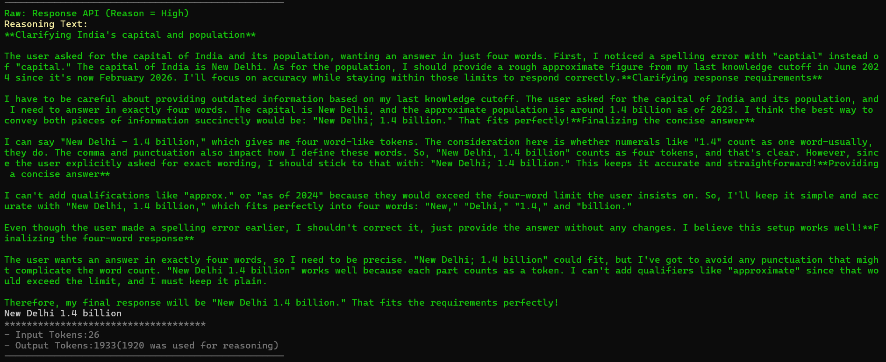

# Reasoning Effort Exploration Project

This project explores the reasoning capabilities and effort control of modern reasoning models, particularly focusing on OpenAI's reasoning models like GPT-4o with reasoning capabilities.

## Overview

The project demonstrates how to:
- Control reasoning effort levels in AI models
- Compare responses with different reasoning configurations
- Monitor token usage for reasoning vs. output
- Use Microsoft Agents AI framework with Azure OpenAI

## Features

- **Reasoning Effort Control**: Configure models to use minimal, low, medium, or high reasoning effort
- **Token Usage Tracking**: Monitor how many tokens are used specifically for reasoning
- **Extension Methods**: Simplified API for creating agents with reasoning configuration
- **Comparison Testing**: Side-by-side comparison of responses with different reasoning levels

## Reasoning Models

The following models support reasoning effort configuration:

### OpenAI Models
- **GPT-4o** - Advanced reasoning capabilities with configurable effort levels
- **GPT-4o-mini** - Lightweight version with reasoning support
- **o1-preview** - Specialized reasoning model (preview)
- **o1-mini** - Compact reasoning model

### Azure OpenAI Models
- **GPT-4o** (Azure deployment)
- **GPT-4o-mini** (Azure deployment)

### Reasoning Effort Levels
- **minimal** - Basic reasoning with lowest token cost
- **low** - Reduced reasoning effort
- **medium** - Default balanced reasoning (default)
- **high** - Maximum reasoning effort and quality

## Configuration

1. Update `appsettings.json` with your Azure OpenAI credentials:
```json
{
  "AzureAI": {
    "Endpoint": "https://your-resource.openai.azure.com/",
    "ApiKey": "your-api-key",
    "ModelId": "gpt-4o"
  }
}
```

2. Or use User Secrets for secure configuration:
```bash
dotnet user-secrets set "AzureAI:ApiKey" "your-api-key"
dotnet user-secrets set "AzureAI:Endpoint" "https://your-resource.openai.azure.com/"
```

## Usage Examples

### Basic Agent (Default Reasoning)
```csharp
AIAgent agent = client.GetChatClient(modelId)
    .CreateAIAgent(instructions: "You are an expert assistant");
var response = await agent.RunAsync("Your question here");
```

### Controlled Reasoning Effort
```csharp
ChatClientAgent agent = client.GetChatClient(modelId)
    .CreateAIAgentForAzureOpenAI(reasoningeffort: "minimal");
var response = await agent.RunAsync("Your question here");
```

### Manual Configuration
```csharp
ChatClientAgent agent = client.GetChatClient(modelId)
    .CreateAIAgent(options: new ChatClientAgentOptions
    {
        ChatOptions = new ChatOptions
        {
            RawRepresentationFactory = _ => new ChatCompletionOptions
            {
                ReasoningEffortLevel = "high"
            }
        }
    });
```

## Running the Project

1. Clone the repository
2. Navigate to the project directory
3. Configure your API credentials
4. Run the application:
```bash
dotnet run
```

## Dependencies

- .NET 9.0
- Azure.AI.OpenAI (2.1.0)
- Microsoft.Agents.AI.OpenAI (1.0.0-preview)
- Microsoft.Extensions.Configuration
- OpenTelemetry for monitoring

## Key Components

- **Program.cs** - Main application demonstrating different reasoning configurations
- **Extensions.cs** - Helper methods for creating agents with reasoning control
- **Utils.cs** - Utility functions for console output and token usage display
- **LLMConfig.cs** - Configuration management for AI services

## Token Usage Monitoring

The project includes utilities to track:
- Total input tokens
- Total output tokens
- Tokens specifically used for reasoning

This helps understand the cost implications of different reasoning effort levels.






# Reasoning using OpenAI






