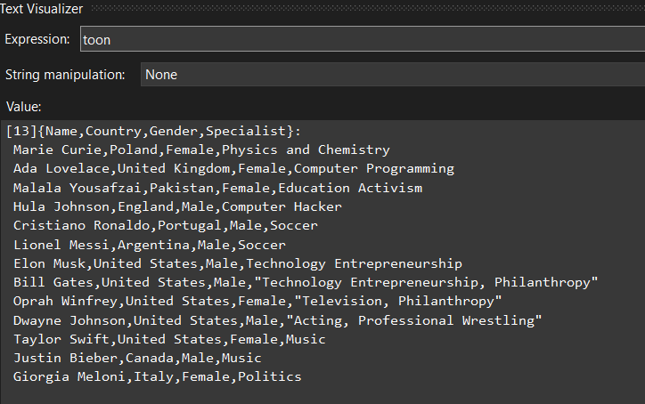
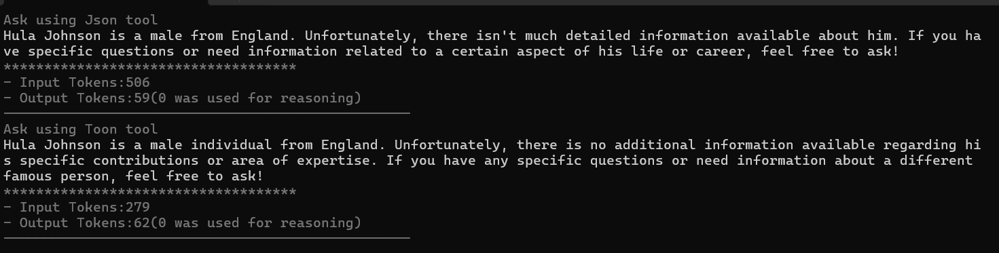

# TOON-For-LLM

A .NET 9.0 console application demonstrating the comparison between JSON and TOON (ToonNet) serialization formats when working with AI agents and Large Language Models (LLMs).

## Overview

This project showcases how different serialization formats affect token usage and efficiency when communicating with AI models. It compares traditional JSON serialization with the more compact TOON format using the ToonNet library.

## Features

- **Dual Serialization Comparison**: Side-by-side comparison of JSON vs TOON serialization
- **AI Agent Integration**: Uses Microsoft Agents AI framework with Azure OpenAI
- **Token Usage Analysis**: Detailed tracking of input/output tokens and reasoning tokens
- **Famous People Dataset**: Sample data for testing serialization efficiency
- **Configuration Management**: Secure configuration with user secrets support

## Architecture

### Core Components

- **Program.cs**: Main application entry point and agent orchestration
- **Specialist.cs**: Data model for famous people information
- **LLMConfig.cs**: Configuration management for Azure OpenAI settings
- **Extensions.cs**: Usage details extensions for token analysis
- **Utils.cs**: Console output utilities with color coding

### Dependencies

- **Microsoft.Agents.AI.OpenAI** (1.0.0-preview.251007.1): AI agent framework
- **Azure.AI.OpenAI** (2.1.0): Azure OpenAI client
- **ToonNet** (1.0.4): TOON serialization library
- **Microsoft.Extensions.Configuration** (9.0.9): Configuration management
- **OpenTelemetry** (1.13.1): Observability and monitoring

## Getting Started

### Prerequisites

- .NET 9.0 SDK
- Azure OpenAI service access
- Visual Studio 2022 or VS Code

### Configuration

1. **Set up Azure OpenAI credentials**:
   ```bash
   dotnet user-secrets set "AzureAI:Endpoint" "your-azure-openai-endpoint"
   dotnet user-secrets set "AzureAI:ApiKey" "your-api-key"
   dotnet user-secrets set "AzureAI:ModelId" "gpt-4o"
   ```

2. **Update appsettings.json** (optional):
   ```json
   {
     "AzureAI": {
       "Endpoint": "",
       "ApiKey": "",
       "ModelId": "gpt-4o"
     }
   }
   ```

### Running the Application

```bash
cd ConsoleApp
dotnet run
```

## How It Works

The application creates two AI agents with identical instructions but different tool implementations:

1. **JSON Agent**: Uses traditional JSON serialization for data exchange
2. **TOON Agent**: Uses ToonNet's compact TOON format for data exchange

Both agents answer questions about famous people using their respective serialization formats, allowing for direct comparison of:
- Token usage efficiency
- Response quality
- Performance characteristics

### Sample Output

```
Ask using Json tool
[Agent response with JSON data]
************************************
- Input Tokens: 150
- Output Tokens: 75 (10 was used for reasoning)
--------------------------------------------------

Ask using Toon tool
[Agent response with TOON data]
************************************
- Input Tokens: 120
- Output Tokens: 65 (8 was used for reasoning)
--------------------------------------------------
```

## Data Model

The application uses a `FamousPeople` class with the following properties:
- **Name**: Person's full name
- **Country**: Country of origin
- **Gender**: Gender identity
- **Specialist**: Area of expertise or fame

## Key Benefits of TOON Format

- **Reduced Token Usage**: More compact serialization reduces API costs
- **Faster Processing**: Less data to transmit and process
- **Maintained Functionality**: Full compatibility with existing data structures
- **Easy Integration**: Drop-in replacement for JSON in many scenarios

## Project Structure

```
17.TOON-For-LLM/
├── ConsoleApp/
│   ├── Program.cs              # Main application logic
│   ├── Specialist.cs           # Data models
│   ├── LLMConfig.cs           # Configuration management
│   ├── Extensions.cs          # Usage tracking extensions
│   ├── Utils.cs               # Console utilities
│   ├── appsettings.json       # Application settings
│   ├── specialist.json        # Sample data
│   └── ConsoleApp.csproj      # Project file
├── 17.TOON-For-LLM.sln       # Solution file
└── README.md                  # This file
```

## Contributing

1. Fork the repository
2. Create a feature branch
3. Make your changes
4. Add tests if applicable
5. Submit a pull request

## License

This project is part of the Microsoft Agent Framework learning series and is intended for educational purposes.

## Related Resources

- [Microsoft Agents AI Documentation](https://docs.microsoft.com/en-us/dotnet/ai/)
- [Azure OpenAI Service](https://azure.microsoft.com/en-us/products/ai-services/openai-service)
- [ToonNet Library](https://www.nuget.org/packages/ToonNet/)
- [.NET 9.0 Documentation](https://docs.microsoft.com/en-us/dotnet/core/whats-new/dotnet-9)



