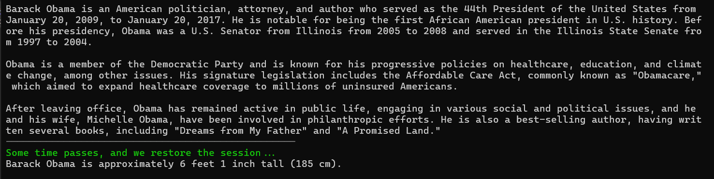

# Chat History Provider Sample

This sample demonstrates how to implement a custom `ChatHistoryProvider` in the Microsoft Agent Framework to persist and restore conversation history across sessions.

## Overview

The `ChatHistoryProvider` allows you to control how chat history is stored and retrieved, enabling conversation continuity across multiple sessions. This sample shows a file-based implementation that stores chat messages in JSON format.

## Features

- Custom chat history persistence using file storage
- Session serialization and deserialization
- Conversation continuity across application restarts
- Integration with Azure OpenAI

## Prerequisites

- .NET 9.0 SDK
- Azure OpenAI account with API access
- Visual Studio 2022 or VS Code

## Configuration

1. Update `appsettings.json` with your Azure OpenAI credentials:

```json
{
  "AzureAI": {
    "Endpoint": "https://your-resource.openai.azure.com/",
    "ApiKey": "your-api-key",
    "ModelId": "gpt-4o"
  }
}
```

Alternatively, use User Secrets for secure credential storage:

```bash
dotnet user-secrets set "AzureAI:Endpoint" "https://your-resource.openai.azure.com/"
dotnet user-secrets set "AzureAI:ApiKey" "your-api-key"
```

## Key Components

### ChatHistoryProvider Implementation

The `MyMessageStore` class extends `ChatHistoryProvider` and implements two key methods:

- **ProvideChatHistoryAsync**: Retrieves stored chat history when a session is restored
- **StoreChatHistoryAsync**: Persists chat messages after each agent interaction

```csharp
class MyMessageStore : ChatHistoryProvider
{
    protected override async ValueTask<IEnumerable<ChatMessage>> ProvideChatHistoryAsync(
        InvokingContext context, CancellationToken cancellationToken = default)
    {
        // Load and return chat history from storage
    }

    protected override async ValueTask StoreChatHistoryAsync(
        InvokedContext context, CancellationToken cancellationToken = default)
    {
        // Save chat messages to storage
    }
}
```

### Session Management

The sample demonstrates:
1. Creating a new agent session
2. Running queries and storing responses
3. Serializing the session state
4. Deserializing and restoring the session
5. Continuing the conversation with context

## How It Works

1. **Initial Conversation**: The agent answers "Who is Barack Obama?"
2. **Session Serialization**: The session state is serialized to JSON
3. **Session Restoration**: The serialized session is deserialized
4. **Context Continuation**: The agent answers "How tall is he?" using the restored context

## Running the Sample

```bash
cd ChatHistoryApp
dotnet run
```

## Output



The application demonstrates that the agent maintains context across sessions, answering follow-up questions based on previous conversation history.

## NuGet Packages

- `Azure.AI.OpenAI` (2.9.0-beta.1)
- `Microsoft.Agents.AI` (1.0.0-rc4)
- `Microsoft.Agents.AI.OpenAI` (1.0.0-rc4)
- `Microsoft.Extensions.Configuration.UserSecrets` (6.0.1)

## Learn More

- [Microsoft Agent Framework Documentation](https://learn.microsoft.com/en-us/microsoft-cloud/dev/copilot/agent-framework)
- [Chat History Provider Guide](https://learn.microsoft.com/en-us/microsoft-cloud/dev/copilot/agent-framework/chat-history-provider)
- [Azure OpenAI Service](https://learn.microsoft.com/en-us/azure/ai-services/openai/)
