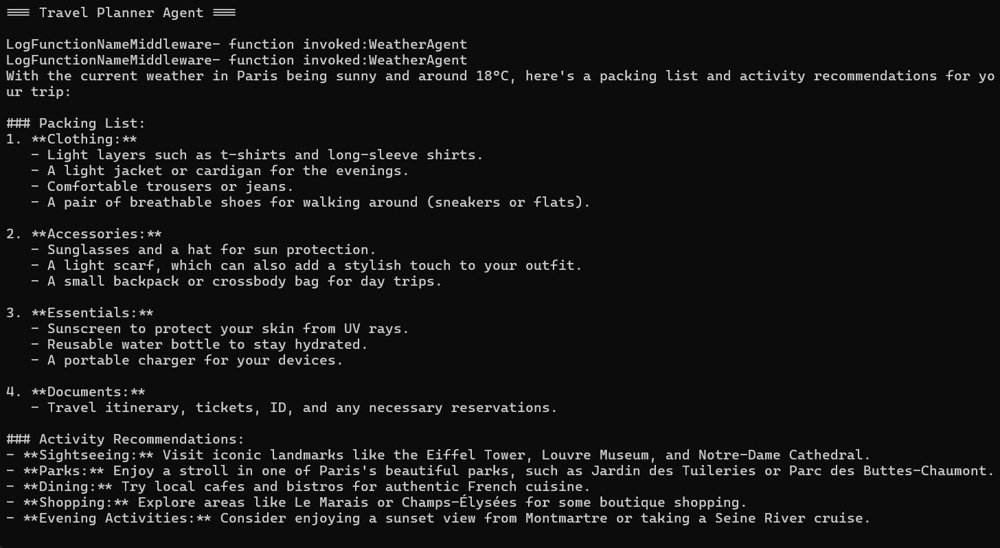

# Agent Tool as Another Agent Tool

Demonstrates how to use one AI agent as a tool for another agent using the **Microsoft Agents AI** framework. A `TravelPlannerAgent` delegates weather lookups to a `WeatherAgent` by exposing it as a callable tool via `.AsAIFunction()`.



## How It Works

1. `WeatherAgent` — an inner agent with a `GetWeather` function tool that returns simulated weather for Amsterdam, Paris, and Tokyo.
2. `TravelPlannerAgent` — an outer agent that calls `WeatherAgent` as a tool (via `.AsAIFunction()`), then gives packing/activity recommendations based on the weather.
3. A middleware (`LogFunctionNameMiddleware`) logs every tool invocation on the outer agent.

## Prerequisites

- [.NET 9 SDK](https://dotnet.microsoft.com/download)
- An Azure OpenAI resource with a `gpt-4o-mini` deployment

## Configuration

Set your Azure OpenAI credentials using **User Secrets** (recommended):

```bash
cd AgentApp
dotnet user-secrets set "AzureAI:Endpoint" "https://<your-resource>.openai.azure.com/"
dotnet user-secrets set "AzureAI:ApiKey" "<your-api-key>"
```

Or update `AgentApp/appsettings.json` directly (not recommended for secrets):

```json
{
  "AzureAI": {
    "Endpoint": "https://<your-resource>.openai.azure.com/",
    "ApiKey": "<your-api-key>",
    "ModelId": "gpt-4o-mini"
  }
}
```

## Run

```bash
cd AgentApp
dotnet run
```

Expected output:

```
=== Travel Planner Agent ===

LogFunctionNameMiddleware- function invoked: WeatherAgent
[Travel recommendations based on Paris weather]
```

## Key Packages

| Package | Version |
|---|---|
| `Microsoft.Agents.AI` | 1.0.0-rc4 |
| `Microsoft.Agents.AI.OpenAI` | 1.0.0-rc4 |
| `Azure.AI.OpenAI` | 2.9.0-beta.1 |

## Key Concept

```csharp
// Expose an agent as a tool for another agent
tools: [weatherAgent.AsAIFunction()]
```

This is the core pattern — any `AIAgent` can be wrapped as an `AIFunction` and passed as a tool to another agent, enabling composable multi-agent pipelines.
