# Agent2Agent (A2A) Protocol — File Agent Demo

## What is A2A?

**Agent2Agent (A2A)** is an open protocol that allows AI agents to communicate with each other — regardless of which framework, language, or vendor built them.

Think of it like HTTP for agents. Just as any browser can talk to any web server over HTTP, any A2A-compatible agent can talk to any other A2A-compatible agent over the A2A protocol.

> **Beginner analogy:** Imagine you hire a contractor (Client Agent) to renovate your house. The contractor doesn't do everything themselves — they call a plumber (Server Agent) for pipes, an electrician for wiring, etc. Each specialist has a "business card" (Agent Card) that says what they can do. The contractor reads the card, knows what to ask, and delegates the work. That's A2A.

---

## Core Concepts

### Agent Card
An Agent Card is a JSON document that an agent publishes to describe itself — its name, capabilities, skills, and how to reach it. It's the agent's "business card".

Clients discover it by calling `GET /.well-known/agent.json` on the server.

```json
{
  "name": "FilesAgent",
  "description": "Handles request relating to files",
  "url": "http://localhost:5000",
  "version": "1.0.0",
  "protocolVersion": "0.3.0",
  "capabilities": {
    "streaming": false,
    "pushNotifications": false
  },
  "skills": [
    {
      "id": "my-file_agent",
      "name": "File Expert",
      "description": "Handles requests relating to files on hard disk",
      "tags": ["files", "folders"],
      "examples": ["What files are there in Folder 'Demo1'"]
    }
  ],
  "preferredTransport": "JSONRPC"
}
```

### Task
A Task is the unit of work in A2A. The client sends a task (a message) to the server agent, and the server responds with a result. Tasks can be short-lived (single request/response) or long-running with status updates.

### Transport
A2A supports **JSON-RPC over HTTP** as the default transport. The client posts a JSON-RPC request to the server's URL, and the server responds with the result.

---

## How This Demo Works

This solution has two projects:

```
Agent2Agent.Client  ──── A2A (JSON-RPC) ────►  Agent2Agent.Server
  (ClientAgent)                                   (FilesAgent)
  Uses GPT-4o-mini                                Uses GPT-4o-mini
  Talks to user                                   Has FileSystemTools
```

### Flow

```
User types a question
       │
       ▼
  ClientAgent (Client)
  - Receives user message
  - Recognises it needs file operations
  - Calls FilesAgent as a tool via A2A
       │
       ▼  HTTP JSON-RPC to http://localhost:5000
  FilesAgent (Server)
  - Receives the task
  - Calls FileSystemTools (list/read/create/delete files)
  - Returns the result
       │
       ▼
  ClientAgent formats and shows the answer to the user
```

### Server — Agent Card & A2A Endpoint

The server publishes its Agent Card and handles incoming tasks:

```csharp
// Server registers the agent and exposes the A2A endpoint
app.MapA2A(agent, path: "/",
           agentCard: agentCard,
           taskManager => app.MapWellKnownAgentCard(taskManager, "/"));
```

### Client — Discovering and Calling the Remote Agent

The client resolves the Agent Card from the server and wraps the remote agent as a local tool:

```csharp
// Resolve the remote agent's card from /.well-known/agent.json
A2ACardResolver agentCardResolver = new A2ACardResolver(new Uri("http://localhost:5000/"));
AIAgent remoteAgent = await agentCardResolver.GetAIAgentAsync();

// Use the remote agent as a tool in the local agent
ChatClientAgent agent = client.GetChatClient("gpt-4o-mini")
    .AsAIAgent(
        name: "ClientAgent",
        tools: [remoteAgent.AsAIFunction()]);
```

### Server — FileSystemTools

The server exposes these file operations as tools to its LLM:

| Method | Description |
|---|---|
| `GetRootFolder()` | Returns the root working folder |
| `GetFiles(folderPath)` | Lists files in a folder |
| `GetFolders(folderPath)` | Lists sub-folders |
| `CreateFolder(folderPath)` | Creates a new folder |
| `CreateFile(filePath, content)` | Creates a file with content |
| `GetFileContent(filePath)` | Reads a file's content |
| `MoveFile(src, dest)` | Moves a file |
| `MoveFolder(src, dest)` | Moves a folder |
| `DeleteFile(filePath)` | Deletes a file |
| `DeleteFolder(folderPath)` | Deletes a folder |

All operations are sandboxed to `C:\Maran\FunctionCallingExample` — the agent cannot access anything outside this root.

---

## Running the Demo

1. Start the **Server** project first (`Agent2Agent.Server`)
2. Start the **Client** project (`Agent2Agent.Client`)
3. Type a question at the `>` prompt, e.g.:
   - `What files are in the root folder?`
   - `Create a file called notes.txt with the content 'Hello World'`
   - `List all folders`

The client delegates file-related tasks to the server agent automatically.

---

## Screenshots

### Architecture Overview
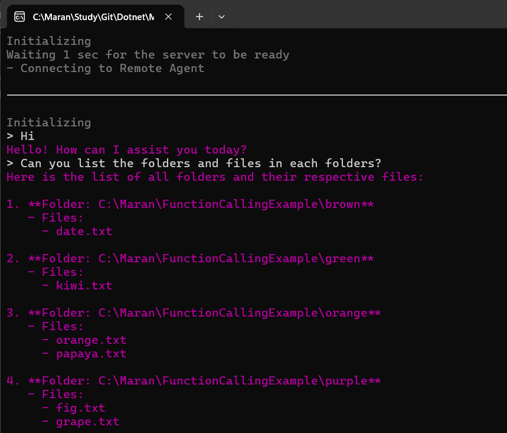

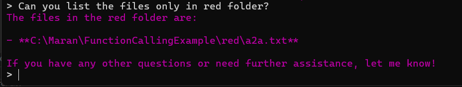

### Agent Card
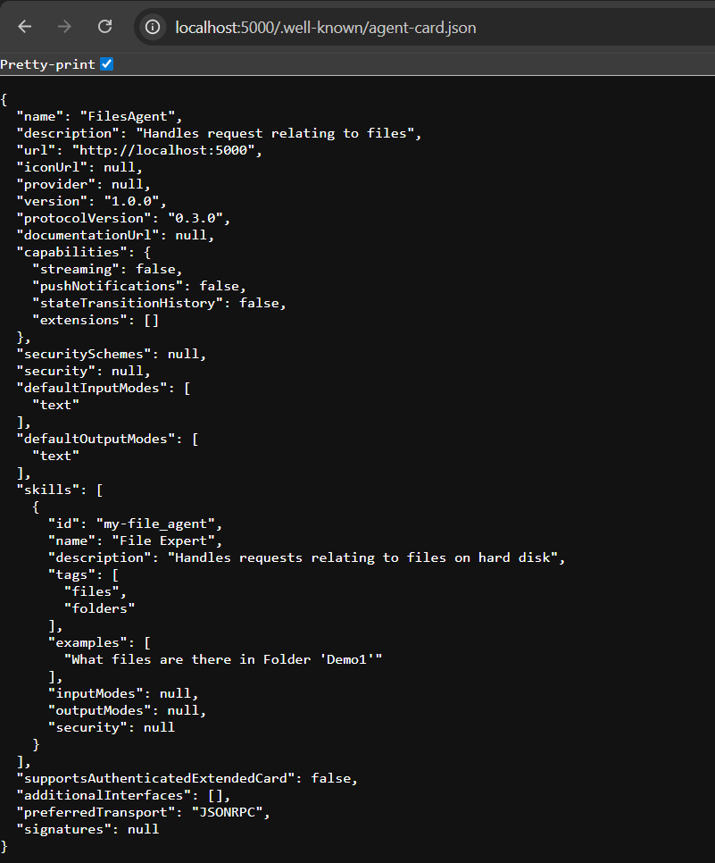

### Client connecting to Server
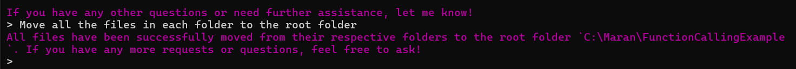

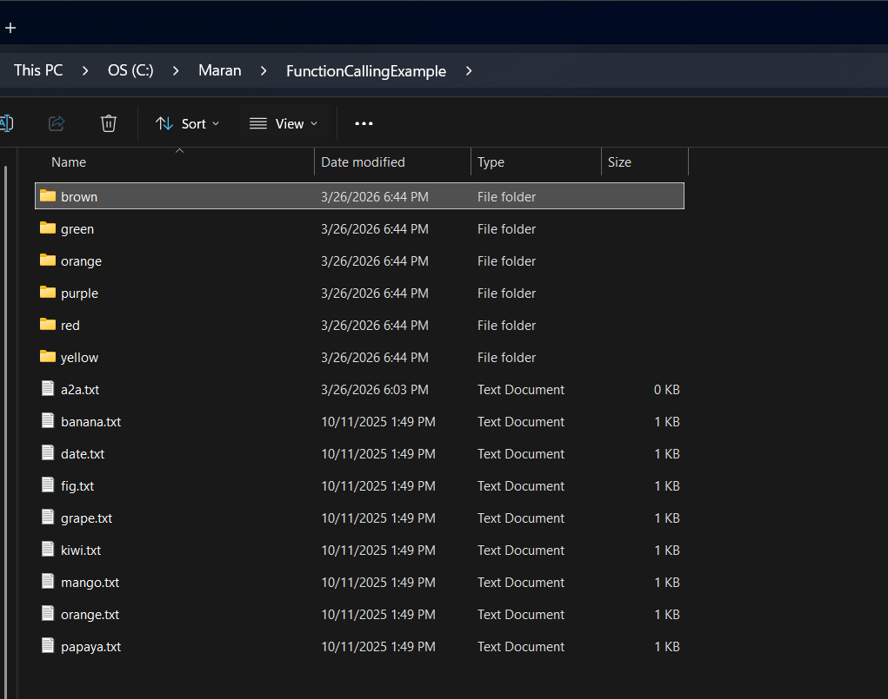

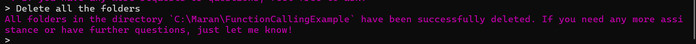

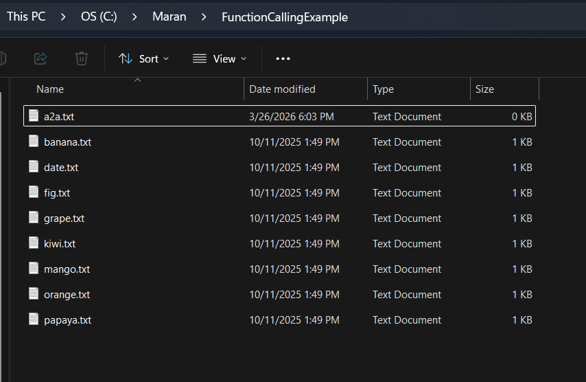

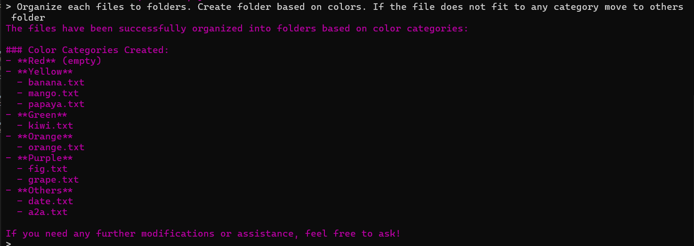

### Tool Calling on the Server
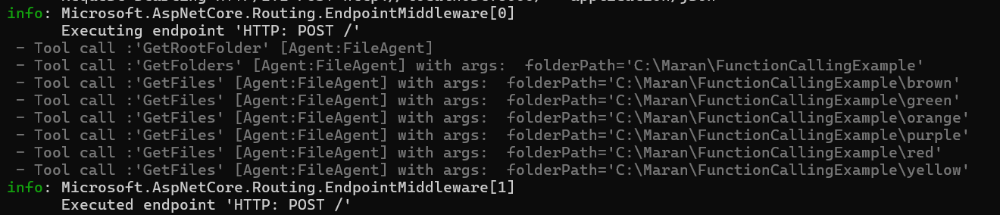

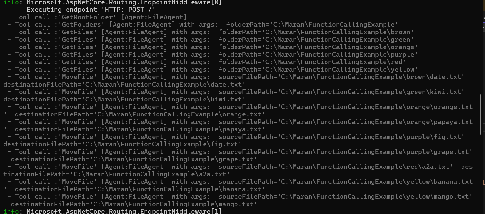

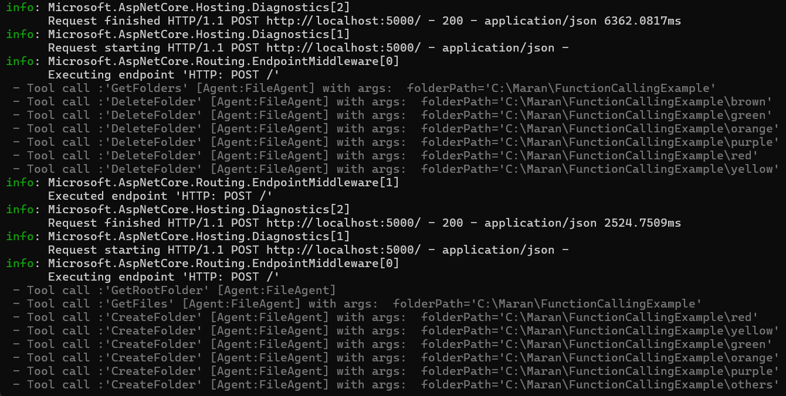

---

## A2A vs MCP — What's the Difference?

Both A2A and MCP (Model Context Protocol) are open protocols in the AI agent ecosystem, but they solve different problems.

| | **A2A** | **MCP** |
|---|---|---|
| **Full name** | Agent2Agent Protocol | Model Context Protocol |
| **Created by** | Google (open spec) | Anthropic (open spec) |
| **Purpose** | Agent ↔ Agent communication | LLM ↔ Tools/Data communication |
| **Who talks to whom** | One AI agent talks to another AI agent | An LLM talks to external tools, APIs, or data sources |
| **Both sides are** | AI agents (with their own LLMs) | One side is an LLM; the other is a tool/resource server |
| **Discovery** | Agent Card (`/.well-known/agent.json`) | MCP server manifest |
| **Transport** | JSON-RPC over HTTP | JSON-RPC over HTTP or stdio |
| **Typical use** | Orchestrating multiple specialised agents | Giving a single LLM access to tools and data |

### Simple Mental Model

```
MCP:   LLM  ──────────►  Tool / Data Source
              (give me data, run this function)

A2A:   Agent ─────────►  Agent
              (handle this task for me)
```

- **MCP** is about extending what a single LLM can *do* — connecting it to databases, APIs, file systems, calendars, etc.
- **A2A** is about connecting multiple *autonomous agents* together — each agent has its own LLM, memory, and tools, and they collaborate to complete a larger goal.

### Use Cases

#### When to use MCP
- You want your LLM to query a database
- You want your LLM to call a REST API (e.g. weather, stock prices)
- You want your LLM to read/write files on disk
- You want your LLM to search the web or a knowledge base
- You want to give a single agent access to many tools from different vendors

#### When to use A2A
- You have a **specialist agent** (e.g. a billing agent, a file agent, a code review agent) and want other agents to delegate work to it
- You want to build a **multi-agent pipeline** where agents hand off tasks to each other
- You want agents built in **different frameworks** (e.g. one in LangChain, one in Semantic Kernel, one in Microsoft Agents) to work together
- You want to **scale** by running agents as independent services that can be deployed, versioned, and replaced independently

### Can you use both together?

Yes — and this demo is a good example. The **Server agent uses MCP-style tool calling** (FileSystemTools via `AIFunctionFactory`) to interact with the file system, while the **Client agent uses A2A** to delegate the entire task to the server agent. In real-world systems, you'll often see both protocols working together:

```
User
 │
 ▼
Orchestrator Agent  ──── A2A ────►  File Agent  ──── MCP/Tools ────►  File System
                    ──── A2A ────►  Email Agent ──── MCP/Tools ────►  Email API
                    ──── A2A ────►  DB Agent    ──── MCP/Tools ────►  Database
```

---

## Key Takeaways

- **A2A** lets agents talk to agents — it's the protocol for multi-agent collaboration
- **MCP** lets an LLM talk to tools and data — it's the protocol for extending a single agent's capabilities
- An **Agent Card** is how an A2A server advertises what it can do
- A2A is **transport-agnostic** and **framework-agnostic** — any agent can talk to any other agent
- This demo shows a **two-agent system**: a general-purpose client agent that delegates file tasks to a specialised file agent
