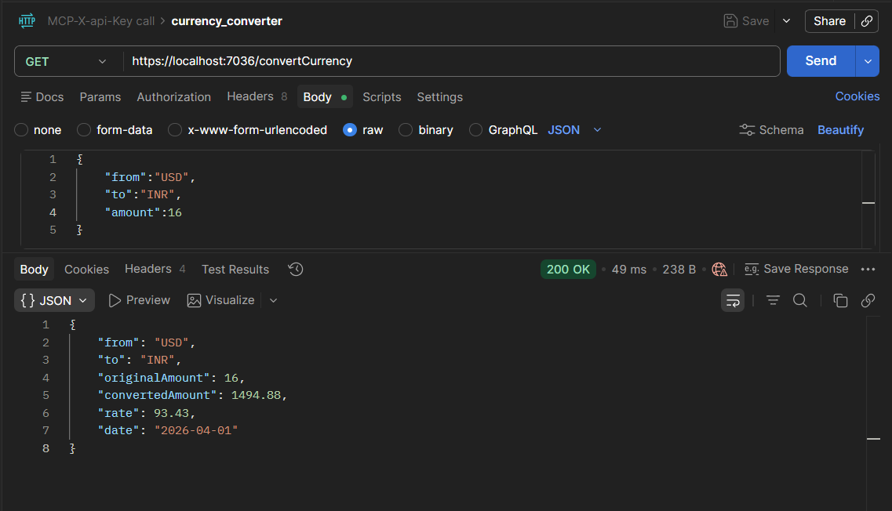
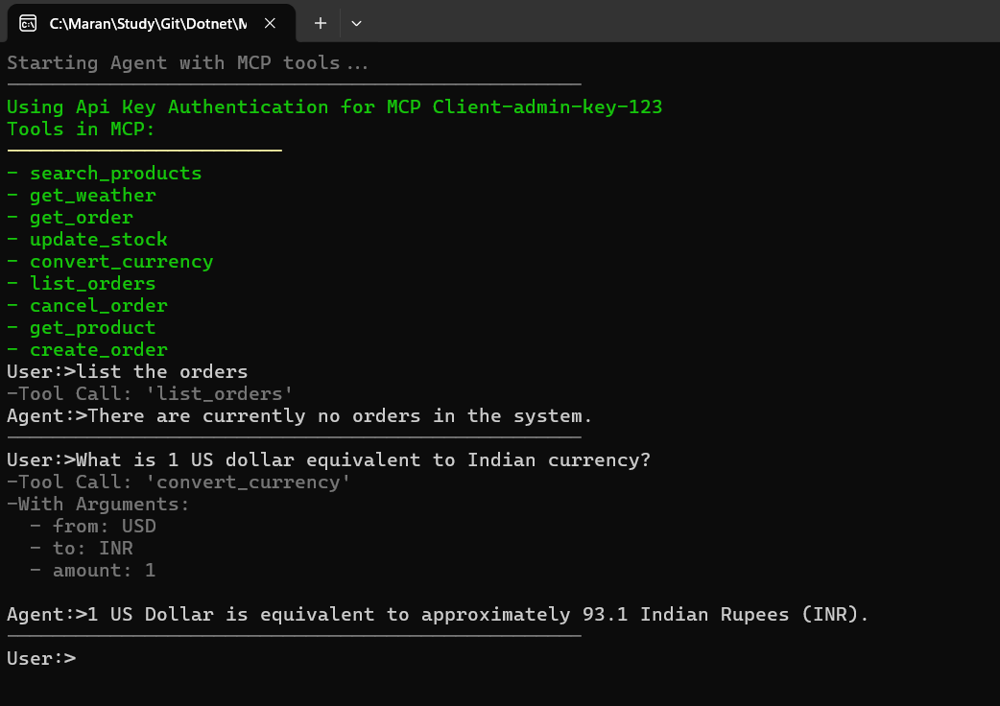
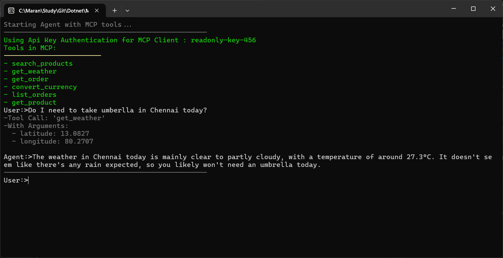
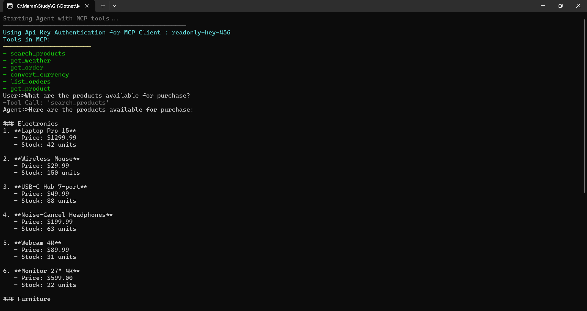

- Set the X-api-key to admin-key-123
- Check the tools using the /getTools Endpoint
```json
[
    {
        "protocolTool": {
            "name": "search_products",
            "title": null,
            "description": "Search the product catalog. Optionally filter by category and/or maximum price.",
            "inputSchema": {
                "type": "object",
                "properties": {
                    "category": {
                        "description": "Category to filter by, e.g. 'Electronics' or 'Furniture'. Leave empty for all.",
                        "type": [
                            "string",
                            "null"
                        ],
                        "default": null
                    },
                    "maxPrice": {
                        "description": "Maximum price in USD.",
                        "type": [
                            "number",
                            "null"
                        ],
                        "default": null
                    }
                }
            },
            "outputSchema": null,
            "annotations": null,
            "execution": null,
            "icons": null,
            "_meta": null
        },
        "name": "search_products",
        "title": null,
        "description": "Search the product catalog. Optionally filter by category and/or maximum price.",
        "jsonSchema": {
            "type": "object",
            "properties": {
                "category": {
                    "description": "Category to filter by, e.g. 'Electronics' or 'Furniture'. Leave empty for all.",
                    "type": [
                        "string",
                        "null"
                    ],
                    "default": null
                },
                "maxPrice": {
                    "description": "Maximum price in USD.",
                    "type": [
                        "number",
                        "null"
                    ],
                    "default": null
                }
            }
        },
        "returnJsonSchema": null,
        "jsonSerializerOptions": {
            "converters": [
                {
                    "type": null
                }
            ],
            "typeInfoResolver": {},
            "typeInfoResolverChain": [
                {},
                {}
            ],
            "allowOutOfOrderMetadataProperties": false,
            "allowTrailingCommas": false,
            "defaultBufferSize": 16384,
            "encoder": null,
            "dictionaryKeyPolicy": null,
            "ignoreNullValues": false,
            "defaultIgnoreCondition": 3,
            "numberHandling": 1,
            "preferredObjectCreationHandling": 0,
            "ignoreReadOnlyProperties": false,
            "ignoreReadOnlyFields": false,
            "includeFields": false,
            "maxDepth": 0,
            "propertyNamingPolicy": {},
            "propertyNameCaseInsensitive": true,
            "readCommentHandling": 0,
            "unknownTypeHandling": 0,
            "unmappedMemberHandling": 0,
            "writeIndented": false,
            "indentCharacter": " ",
            "indentSize": 2,
            "referenceHandler": null,
            "newLine": "\r\n",
            "respectNullableAnnotations": false,
            "respectRequiredConstructorParameters": false,
            "allowDuplicateProperties": true,
            "isReadOnly": true
        },
        "underlyingMethod": null,
        "additionalProperties": {}
    },
    {
        "protocolTool": {
            "name": "get_weather",
            "title": null,
            "description": "Get current weather for a city latitude/longitude. Returns temperature, wind speed and weather description.",
            "inputSchema": {
                "type": "object",
                "properties": {
                    "latitude": {
                        "description": "Latitude of the location (e.g 40.7128 for Newyork)",
                        "type": "number"
                    },
                    "longitude": {
                        "description": "Longitude of the location (e.g -74.0060 for New York)",
                        "type": "number"
                    }
                },
                "required": [
                    "latitude",
                    "longitude"
                ]
            },
            "outputSchema": null,
            "annotations": null,
            "execution": {
                "taskSupport": "optional"
            },
            "icons": null,
            "_meta": null
        },
        "name": "get_weather",
        "title": null,
        "description": "Get current weather for a city latitude/longitude. Returns temperature, wind speed and weather description.",
        "jsonSchema": {
            "type": "object",
            "properties": {
                "latitude": {
                    "description": "Latitude of the location (e.g 40.7128 for Newyork)",
                    "type": "number"
                },
                "longitude": {
                    "description": "Longitude of the location (e.g -74.0060 for New York)",
                    "type": "number"
                }
            },
            "required": [
                "latitude",
                "longitude"
            ]
        },
        "returnJsonSchema": null,
        "jsonSerializerOptions": {
            "converters": [
                {
                    "type": null
                }
            ],
            "typeInfoResolver": {},
            "typeInfoResolverChain": [
                {},
                {}
            ],
            "allowOutOfOrderMetadataProperties": false,
            "allowTrailingCommas": false,
            "defaultBufferSize": 16384,
            "encoder": null,
            "dictionaryKeyPolicy": null,
            "ignoreNullValues": false,
            "defaultIgnoreCondition": 3,
            "numberHandling": 1,
            "preferredObjectCreationHandling": 0,
            "ignoreReadOnlyProperties": false,
            "ignoreReadOnlyFields": false,
            "includeFields": false,
            "maxDepth": 0,
            "propertyNamingPolicy": {},
            "propertyNameCaseInsensitive": true,
            "readCommentHandling": 0,
            "unknownTypeHandling": 0,
            "unmappedMemberHandling": 0,
            "writeIndented": false,
            "indentCharacter": " ",
            "indentSize": 2,
            "referenceHandler": null,
            "newLine": "\r\n",
            "respectNullableAnnotations": false,
            "respectRequiredConstructorParameters": false,
            "allowDuplicateProperties": true,
            "isReadOnly": true
        },
        "underlyingMethod": null,
        "additionalProperties": {}
    },
    {
        "protocolTool": {
            "name": "get_order",
            "title": null,
            "description": "Retrieve an order by its ID.",
            "inputSchema": {
                "type": "object",
                "properties": {
                    "orderId": {
                        "description": "Order ID, e.g. 'ORD-1001'.",
                        "type": "string"
                    }
                },
                "required": [
                    "orderId"
                ]
            },
            "outputSchema": null,
            "annotations": null,
            "execution": null,
            "icons": null,
            "_meta": null
        },
        "name": "get_order",
        "title": null,
        "description": "Retrieve an order by its ID.",
        "jsonSchema": {
            "type": "object",
            "properties": {
                "orderId": {
                    "description": "Order ID, e.g. 'ORD-1001'.",
                    "type": "string"
                }
            },
            "required": [
                "orderId"
            ]
        },
        "returnJsonSchema": null,
        "jsonSerializerOptions": {
            "converters": [
                {
                    "type": null
                }
            ],
            "typeInfoResolver": {},
            "typeInfoResolverChain": [
                {},
                {}
            ],
            "allowOutOfOrderMetadataProperties": false,
            "allowTrailingCommas": false,
            "defaultBufferSize": 16384,
            "encoder": null,
            "dictionaryKeyPolicy": null,
            "ignoreNullValues": false,
            "defaultIgnoreCondition": 3,
            "numberHandling": 1,
            "preferredObjectCreationHandling": 0,
            "ignoreReadOnlyProperties": false,
            "ignoreReadOnlyFields": false,
            "includeFields": false,
            "maxDepth": 0,
            "propertyNamingPolicy": {},
            "propertyNameCaseInsensitive": true,
            "readCommentHandling": 0,
            "unknownTypeHandling": 0,
            "unmappedMemberHandling": 0,
            "writeIndented": false,
            "indentCharacter": " ",
            "indentSize": 2,
            "referenceHandler": null,
            "newLine": "\r\n",
            "respectNullableAnnotations": false,
            "respectRequiredConstructorParameters": false,
            "allowDuplicateProperties": true,
            "isReadOnly": true
        },
        "underlyingMethod": null,
        "additionalProperties": {}
    },
    {
        "protocolTool": {
            "name": "update_stock",
            "title": null,
            "description": "Update the stock quantity for a product. Requires admin role.",
            "inputSchema": {
                "type": "object",
                "properties": {
                    "productId": {
                        "description": "Product ID.",
                        "type": "string"
                    },
                    "newQuantity": {
                        "description": "New stock quantity (must be >= 0).",
                        "type": "integer"
                    }
                },
                "required": [
                    "productId",
                    "newQuantity"
                ]
            },
            "outputSchema": null,
            "annotations": null,
            "execution": null,
            "icons": null,
            "_meta": null
        },
        "name": "update_stock",
        "title": null,
        "description": "Update the stock quantity for a product. Requires admin role.",
        "jsonSchema": {
            "type": "object",
            "properties": {
                "productId": {
                    "description": "Product ID.",
                    "type": "string"
                },
                "newQuantity": {
                    "description": "New stock quantity (must be >= 0).",
                    "type": "integer"
                }
            },
            "required": [
                "productId",
                "newQuantity"
            ]
        },
        "returnJsonSchema": null,
        "jsonSerializerOptions": {
            "converters": [
                {
                    "type": null
                }
            ],
            "typeInfoResolver": {},
            "typeInfoResolverChain": [
                {},
                {}
            ],
            "allowOutOfOrderMetadataProperties": false,
            "allowTrailingCommas": false,
            "defaultBufferSize": 16384,
            "encoder": null,
            "dictionaryKeyPolicy": null,
            "ignoreNullValues": false,
            "defaultIgnoreCondition": 3,
            "numberHandling": 1,
            "preferredObjectCreationHandling": 0,
            "ignoreReadOnlyProperties": false,
            "ignoreReadOnlyFields": false,
            "includeFields": false,
            "maxDepth": 0,
            "propertyNamingPolicy": {},
            "propertyNameCaseInsensitive": true,
            "readCommentHandling": 0,
            "unknownTypeHandling": 0,
            "unmappedMemberHandling": 0,
            "writeIndented": false,
            "indentCharacter": " ",
            "indentSize": 2,
            "referenceHandler": null,
            "newLine": "\r\n",
            "respectNullableAnnotations": false,
            "respectRequiredConstructorParameters": false,
            "allowDuplicateProperties": true,
            "isReadOnly": true
        },
        "underlyingMethod": null,
        "additionalProperties": {}
    },
    {
        "protocolTool": {
            "name": "convert_currency",
            "title": null,
            "description": "Convert an amount from one currency to another using live exchange rates. Supported codes: USD, EUR, GBP, JPY, CAD, AUD, CHF, INR, etc.",
            "inputSchema": {
                "type": "object",
                "properties": {
                    "from": {
                        "description": "Source currency code, e.g. 'USD'.",
                        "type": "string"
                    },
                    "to": {
                        "description": "Target currency code, e.g. 'EUR'.",
                        "type": "string"
                    },
                    "amount": {
                        "description": "Amount to convert.",
                        "type": "number"
                    }
                },
                "required": [
                    "from",
                    "to",
                    "amount"
                ]
            },
            "outputSchema": null,
            "annotations": null,
            "execution": {
                "taskSupport": "optional"
            },
            "icons": null,
            "_meta": null
        },
        "name": "convert_currency",
        "title": null,
        "description": "Convert an amount from one currency to another using live exchange rates. Supported codes: USD, EUR, GBP, JPY, CAD, AUD, CHF, INR, etc.",
        "jsonSchema": {
            "type": "object",
            "properties": {
                "from": {
                    "description": "Source currency code, e.g. 'USD'.",
                    "type": "string"
                },
                "to": {
                    "description": "Target currency code, e.g. 'EUR'.",
                    "type": "string"
                },
                "amount": {
                    "description": "Amount to convert.",
                    "type": "number"
                }
            },
            "required": [
                "from",
                "to",
                "amount"
            ]
        },
        "returnJsonSchema": null,
        "jsonSerializerOptions": {
            "converters": [
                {
                    "type": null
                }
            ],
            "typeInfoResolver": {},
            "typeInfoResolverChain": [
                {},
                {}
            ],
            "allowOutOfOrderMetadataProperties": false,
            "allowTrailingCommas": false,
            "defaultBufferSize": 16384,
            "encoder": null,
            "dictionaryKeyPolicy": null,
            "ignoreNullValues": false,
            "defaultIgnoreCondition": 3,
            "numberHandling": 1,
            "preferredObjectCreationHandling": 0,
            "ignoreReadOnlyProperties": false,
            "ignoreReadOnlyFields": false,
            "includeFields": false,
            "maxDepth": 0,
            "propertyNamingPolicy": {},
            "propertyNameCaseInsensitive": true,
            "readCommentHandling": 0,
            "unknownTypeHandling": 0,
            "unmappedMemberHandling": 0,
            "writeIndented": false,
            "indentCharacter": " ",
            "indentSize": 2,
            "referenceHandler": null,
            "newLine": "\r\n",
            "respectNullableAnnotations": false,
            "respectRequiredConstructorParameters": false,
            "allowDuplicateProperties": true,
            "isReadOnly": true
        },
        "underlyingMethod": null,
        "additionalProperties": {}
    },
    {
        "protocolTool": {
            "name": "list_orders",
            "title": null,
            "description": "List all orders in the system.",
            "inputSchema": {
                "type": "object",
                "properties": {}
            },
            "outputSchema": null,
            "annotations": null,
            "execution": null,
            "icons": null,
            "_meta": null
        },
        "name": "list_orders",
        "title": null,
        "description": "List all orders in the system.",
        "jsonSchema": {
            "type": "object",
            "properties": {}
        },
        "returnJsonSchema": null,
        "jsonSerializerOptions": {
            "converters": [
                {
                    "type": null
                }
            ],
            "typeInfoResolver": {},
            "typeInfoResolverChain": [
                {},
                {}
            ],
            "allowOutOfOrderMetadataProperties": false,
            "allowTrailingCommas": false,
            "defaultBufferSize": 16384,
            "encoder": null,
            "dictionaryKeyPolicy": null,
            "ignoreNullValues": false,
            "defaultIgnoreCondition": 3,
            "numberHandling": 1,
            "preferredObjectCreationHandling": 0,
            "ignoreReadOnlyProperties": false,
            "ignoreReadOnlyFields": false,
            "includeFields": false,
            "maxDepth": 0,
            "propertyNamingPolicy": {},
            "propertyNameCaseInsensitive": true,
            "readCommentHandling": 0,
            "unknownTypeHandling": 0,
            "unmappedMemberHandling": 0,
            "writeIndented": false,
            "indentCharacter": " ",
            "indentSize": 2,
            "referenceHandler": null,
            "newLine": "\r\n",
            "respectNullableAnnotations": false,
            "respectRequiredConstructorParameters": false,
            "allowDuplicateProperties": true,
            "isReadOnly": true
        },
        "underlyingMethod": null,
        "additionalProperties": {}
    },
    {
        "protocolTool": {
            "name": "cancel_order",
            "title": null,
            "description": "Cancel an existing order and restore the stock.",
            "inputSchema": {
                "type": "object",
                "properties": {
                    "orderId": {
                        "description": "Order ID to cancel.",
                        "type": "string"
                    }
                },
                "required": [
                    "orderId"
                ]
            },
            "outputSchema": null,
            "annotations": null,
            "execution": null,
            "icons": null,
            "_meta": null
        },
        "name": "cancel_order",
        "title": null,
        "description": "Cancel an existing order and restore the stock.",
        "jsonSchema": {
            "type": "object",
            "properties": {
                "orderId": {
                    "description": "Order ID to cancel.",
                    "type": "string"
                }
            },
            "required": [
                "orderId"
            ]
        },
        "returnJsonSchema": null,
        "jsonSerializerOptions": {
            "converters": [
                {
                    "type": null
                }
            ],
            "typeInfoResolver": {},
            "typeInfoResolverChain": [
                {},
                {}
            ],
            "allowOutOfOrderMetadataProperties": false,
            "allowTrailingCommas": false,
            "defaultBufferSize": 16384,
            "encoder": null,
            "dictionaryKeyPolicy": null,
            "ignoreNullValues": false,
            "defaultIgnoreCondition": 3,
            "numberHandling": 1,
            "preferredObjectCreationHandling": 0,
            "ignoreReadOnlyProperties": false,
            "ignoreReadOnlyFields": false,
            "includeFields": false,
            "maxDepth": 0,
            "propertyNamingPolicy": {},
            "propertyNameCaseInsensitive": true,
            "readCommentHandling": 0,
            "unknownTypeHandling": 0,
            "unmappedMemberHandling": 0,
            "writeIndented": false,
            "indentCharacter": " ",
            "indentSize": 2,
            "referenceHandler": null,
            "newLine": "\r\n",
            "respectNullableAnnotations": false,
            "respectRequiredConstructorParameters": false,
            "allowDuplicateProperties": true,
            "isReadOnly": true
        },
        "underlyingMethod": null,
        "additionalProperties": {}
    },
    {
        "protocolTool": {
            "name": "get_product",
            "title": null,
            "description": "Get full details for a single product by its ID.",
            "inputSchema": {
                "type": "object",
                "properties": {
                    "productId": {
                        "description": "Product ID, e.g. 'P001'.",
                        "type": "string"
                    }
                },
                "required": [
                    "productId"
                ]
            },
            "outputSchema": null,
            "annotations": null,
            "execution": null,
            "icons": null,
            "_meta": null
        },
        "name": "get_product",
        "title": null,
        "description": "Get full details for a single product by its ID.",
        "jsonSchema": {
            "type": "object",
            "properties": {
                "productId": {
                    "description": "Product ID, e.g. 'P001'.",
                    "type": "string"
                }
            },
            "required": [
                "productId"
            ]
        },
        "returnJsonSchema": null,
        "jsonSerializerOptions": {
            "converters": [
                {
                    "type": null
                }
            ],
            "typeInfoResolver": {},
            "typeInfoResolverChain": [
                {},
                {}
            ],
            "allowOutOfOrderMetadataProperties": false,
            "allowTrailingCommas": false,
            "defaultBufferSize": 16384,
            "encoder": null,
            "dictionaryKeyPolicy": null,
            "ignoreNullValues": false,
            "defaultIgnoreCondition": 3,
            "numberHandling": 1,
            "preferredObjectCreationHandling": 0,
            "ignoreReadOnlyProperties": false,
            "ignoreReadOnlyFields": false,
            "includeFields": false,
            "maxDepth": 0,
            "propertyNamingPolicy": {},
            "propertyNameCaseInsensitive": true,
            "readCommentHandling": 0,
            "unknownTypeHandling": 0,
            "unmappedMemberHandling": 0,
            "writeIndented": false,
            "indentCharacter": " ",
            "indentSize": 2,
            "referenceHandler": null,
            "newLine": "\r\n",
            "respectNullableAnnotations": false,
            "respectRequiredConstructorParameters": false,
            "allowDuplicateProperties": true,
            "isReadOnly": true
        },
        "underlyingMethod": null,
        "additionalProperties": {}
    },
    {
        "protocolTool": {
            "name": "create_order",
            "title": null,
            "description": "Place a new order for a product. Deducts from available stock.",
            "inputSchema": {
                "type": "object",
                "properties": {
                    "productId": {
                        "description": "Product ID to order.",
                        "type": "string"
                    },
                    "quantity": {
                        "description": "Number of units to order.",
                        "type": "integer"
                    }
                },
                "required": [
                    "productId",
                    "quantity"
                ]
            },
            "outputSchema": null,
            "annotations": null,
            "execution": null,
            "icons": null,
            "_meta": null
        },
        "name": "create_order",
        "title": null,
        "description": "Place a new order for a product. Deducts from available stock.",
        "jsonSchema": {
            "type": "object",
            "properties": {
                "productId": {
                    "description": "Product ID to order.",
                    "type": "string"
                },
                "quantity": {
                    "description": "Number of units to order.",
                    "type": "integer"
                }
            },
            "required": [
                "productId",
                "quantity"
            ]
        },
        "returnJsonSchema": null,
        "jsonSerializerOptions": {
            "converters": [
                {
                    "type": null
                }
            ],
            "typeInfoResolver": {},
            "typeInfoResolverChain": [
                {},
                {}
            ],
            "allowOutOfOrderMetadataProperties": false,
            "allowTrailingCommas": false,
            "defaultBufferSize": 16384,
            "encoder": null,
            "dictionaryKeyPolicy": null,
            "ignoreNullValues": false,
            "defaultIgnoreCondition": 3,
            "numberHandling": 1,
            "preferredObjectCreationHandling": 0,
            "ignoreReadOnlyProperties": false,
            "ignoreReadOnlyFields": false,
            "includeFields": false,
            "maxDepth": 0,
            "propertyNamingPolicy": {},
            "propertyNameCaseInsensitive": true,
            "readCommentHandling": 0,
            "unknownTypeHandling": 0,
            "unmappedMemberHandling": 0,
            "writeIndented": false,
            "indentCharacter": " ",
            "indentSize": 2,
            "referenceHandler": null,
            "newLine": "\r\n",
            "respectNullableAnnotations": false,
            "respectRequiredConstructorParameters": false,
            "allowDuplicateProperties": true,
            "isReadOnly": true
        },
        "underlyingMethod": null,
        "additionalProperties": {}
    }
]
```

- Now change the X-api-key to readonly-key-456

```json
[
    {
        "protocolTool": {
            "name": "search_products",
            "title": null,
            "description": "Search the product catalog. Optionally filter by category and/or maximum price.",
            "inputSchema": {
                "type": "object",
                "properties": {
                    "category": {
                        "description": "Category to filter by, e.g. 'Electronics' or 'Furniture'. Leave empty for all.",
                        "type": [
                            "string",
                            "null"
                        ],
                        "default": null
                    },
                    "maxPrice": {
                        "description": "Maximum price in USD.",
                        "type": [
                            "number",
                            "null"
                        ],
                        "default": null
                    }
                }
            },
            "outputSchema": null,
            "annotations": null,
            "execution": null,
            "icons": null,
            "_meta": null
        },
        "name": "search_products",
        "title": null,
        "description": "Search the product catalog. Optionally filter by category and/or maximum price.",
        "jsonSchema": {
            "type": "object",
            "properties": {
                "category": {
                    "description": "Category to filter by, e.g. 'Electronics' or 'Furniture'. Leave empty for all.",
                    "type": [
                        "string",
                        "null"
                    ],
                    "default": null
                },
                "maxPrice": {
                    "description": "Maximum price in USD.",
                    "type": [
                        "number",
                        "null"
                    ],
                    "default": null
                }
            }
        },
        "returnJsonSchema": null,
        "jsonSerializerOptions": {
            "converters": [
                {
                    "type": null
                }
            ],
            "typeInfoResolver": {},
            "typeInfoResolverChain": [
                {},
                {}
            ],
            "allowOutOfOrderMetadataProperties": false,
            "allowTrailingCommas": false,
            "defaultBufferSize": 16384,
            "encoder": null,
            "dictionaryKeyPolicy": null,
            "ignoreNullValues": false,
            "defaultIgnoreCondition": 3,
            "numberHandling": 1,
            "preferredObjectCreationHandling": 0,
            "ignoreReadOnlyProperties": false,
            "ignoreReadOnlyFields": false,
            "includeFields": false,
            "maxDepth": 0,
            "propertyNamingPolicy": {},
            "propertyNameCaseInsensitive": true,
            "readCommentHandling": 0,
            "unknownTypeHandling": 0,
            "unmappedMemberHandling": 0,
            "writeIndented": false,
            "indentCharacter": " ",
            "indentSize": 2,
            "referenceHandler": null,
            "newLine": "\r\n",
            "respectNullableAnnotations": false,
            "respectRequiredConstructorParameters": false,
            "allowDuplicateProperties": true,
            "isReadOnly": true
        },
        "underlyingMethod": null,
        "additionalProperties": {}
    },
    {
        "protocolTool": {
            "name": "get_weather",
            "title": null,
            "description": "Get current weather for a city latitude/longitude. Returns temperature, wind speed and weather description.",
            "inputSchema": {
                "type": "object",
                "properties": {
                    "latitude": {
                        "description": "Latitude of the location (e.g 40.7128 for Newyork)",
                        "type": "number"
                    },
                    "longitude": {
                        "description": "Longitude of the location (e.g -74.0060 for New York)",
                        "type": "number"
                    }
                },
                "required": [
                    "latitude",
                    "longitude"
                ]
            },
            "outputSchema": null,
            "annotations": null,
            "execution": {
                "taskSupport": "optional"
            },
            "icons": null,
            "_meta": null
        },
        "name": "get_weather",
        "title": null,
        "description": "Get current weather for a city latitude/longitude. Returns temperature, wind speed and weather description.",
        "jsonSchema": {
            "type": "object",
            "properties": {
                "latitude": {
                    "description": "Latitude of the location (e.g 40.7128 for Newyork)",
                    "type": "number"
                },
                "longitude": {
                    "description": "Longitude of the location (e.g -74.0060 for New York)",
                    "type": "number"
                }
            },
            "required": [
                "latitude",
                "longitude"
            ]
        },
        "returnJsonSchema": null,
        "jsonSerializerOptions": {
            "converters": [
                {
                    "type": null
                }
            ],
            "typeInfoResolver": {},
            "typeInfoResolverChain": [
                {},
                {}
            ],
            "allowOutOfOrderMetadataProperties": false,
            "allowTrailingCommas": false,
            "defaultBufferSize": 16384,
            "encoder": null,
            "dictionaryKeyPolicy": null,
            "ignoreNullValues": false,
            "defaultIgnoreCondition": 3,
            "numberHandling": 1,
            "preferredObjectCreationHandling": 0,
            "ignoreReadOnlyProperties": false,
            "ignoreReadOnlyFields": false,
            "includeFields": false,
            "maxDepth": 0,
            "propertyNamingPolicy": {},
            "propertyNameCaseInsensitive": true,
            "readCommentHandling": 0,
            "unknownTypeHandling": 0,
            "unmappedMemberHandling": 0,
            "writeIndented": false,
            "indentCharacter": " ",
            "indentSize": 2,
            "referenceHandler": null,
            "newLine": "\r\n",
            "respectNullableAnnotations": false,
            "respectRequiredConstructorParameters": false,
            "allowDuplicateProperties": true,
            "isReadOnly": true
        },
        "underlyingMethod": null,
        "additionalProperties": {}
    },
    {
        "protocolTool": {
            "name": "get_order",
            "title": null,
            "description": "Retrieve an order by its ID.",
            "inputSchema": {
                "type": "object",
                "properties": {
                    "orderId": {
                        "description": "Order ID, e.g. 'ORD-1001'.",
                        "type": "string"
                    }
                },
                "required": [
                    "orderId"
                ]
            },
            "outputSchema": null,
            "annotations": null,
            "execution": null,
            "icons": null,
            "_meta": null
        },
        "name": "get_order",
        "title": null,
        "description": "Retrieve an order by its ID.",
        "jsonSchema": {
            "type": "object",
            "properties": {
                "orderId": {
                    "description": "Order ID, e.g. 'ORD-1001'.",
                    "type": "string"
                }
            },
            "required": [
                "orderId"
            ]
        },
        "returnJsonSchema": null,
        "jsonSerializerOptions": {
            "converters": [
                {
                    "type": null
                }
            ],
            "typeInfoResolver": {},
            "typeInfoResolverChain": [
                {},
                {}
            ],
            "allowOutOfOrderMetadataProperties": false,
            "allowTrailingCommas": false,
            "defaultBufferSize": 16384,
            "encoder": null,
            "dictionaryKeyPolicy": null,
            "ignoreNullValues": false,
            "defaultIgnoreCondition": 3,
            "numberHandling": 1,
            "preferredObjectCreationHandling": 0,
            "ignoreReadOnlyProperties": false,
            "ignoreReadOnlyFields": false,
            "includeFields": false,
            "maxDepth": 0,
            "propertyNamingPolicy": {},
            "propertyNameCaseInsensitive": true,
            "readCommentHandling": 0,
            "unknownTypeHandling": 0,
            "unmappedMemberHandling": 0,
            "writeIndented": false,
            "indentCharacter": " ",
            "indentSize": 2,
            "referenceHandler": null,
            "newLine": "\r\n",
            "respectNullableAnnotations": false,
            "respectRequiredConstructorParameters": false,
            "allowDuplicateProperties": true,
            "isReadOnly": true
        },
        "underlyingMethod": null,
        "additionalProperties": {}
    },
    {
        "protocolTool": {
            "name": "update_stock",
            "title": null,
            "description": "Update the stock quantity for a product. Requires admin role.",
            "inputSchema": {
                "type": "object",
                "properties": {
                    "productId": {
                        "description": "Product ID.",
                        "type": "string"
                    },
                    "newQuantity": {
                        "description": "New stock quantity (must be >= 0).",
                        "type": "integer"
                    }
                },
                "required": [
                    "productId",
                    "newQuantity"
                ]
            },
            "outputSchema": null,
            "annotations": null,
            "execution": null,
            "icons": null,
            "_meta": null
        },
        "name": "update_stock",
        "title": null,
        "description": "Update the stock quantity for a product. Requires admin role.",
        "jsonSchema": {
            "type": "object",
            "properties": {
                "productId": {
                    "description": "Product ID.",
                    "type": "string"
                },
                "newQuantity": {
                    "description": "New stock quantity (must be >= 0).",
                    "type": "integer"
                }
            },
            "required": [
                "productId",
                "newQuantity"
            ]
        },
        "returnJsonSchema": null,
        "jsonSerializerOptions": {
            "converters": [
                {
                    "type": null
                }
            ],
            "typeInfoResolver": {},
            "typeInfoResolverChain": [
                {},
                {}
            ],
            "allowOutOfOrderMetadataProperties": false,
            "allowTrailingCommas": false,
            "defaultBufferSize": 16384,
            "encoder": null,
            "dictionaryKeyPolicy": null,
            "ignoreNullValues": false,
            "defaultIgnoreCondition": 3,
            "numberHandling": 1,
            "preferredObjectCreationHandling": 0,
            "ignoreReadOnlyProperties": false,
            "ignoreReadOnlyFields": false,
            "includeFields": false,
            "maxDepth": 0,
            "propertyNamingPolicy": {},
            "propertyNameCaseInsensitive": true,
            "readCommentHandling": 0,
            "unknownTypeHandling": 0,
            "unmappedMemberHandling": 0,
            "writeIndented": false,
            "indentCharacter": " ",
            "indentSize": 2,
            "referenceHandler": null,
            "newLine": "\r\n",
            "respectNullableAnnotations": false,
            "respectRequiredConstructorParameters": false,
            "allowDuplicateProperties": true,
            "isReadOnly": true
        },
        "underlyingMethod": null,
        "additionalProperties": {}
    },
    {
        "protocolTool": {
            "name": "convert_currency",
            "title": null,
            "description": "Convert an amount from one currency to another using live exchange rates. Supported codes: USD, EUR, GBP, JPY, CAD, AUD, CHF, INR, etc.",
            "inputSchema": {
                "type": "object",
                "properties": {
                    "from": {
                        "description": "Source currency code, e.g. 'USD'.",
                        "type": "string"
                    },
                    "to": {
                        "description": "Target currency code, e.g. 'EUR'.",
                        "type": "string"
                    },
                    "amount": {
                        "description": "Amount to convert.",
                        "type": "number"
                    }
                },
                "required": [
                    "from",
                    "to",
                    "amount"
                ]
            },
            "outputSchema": null,
            "annotations": null,
            "execution": {
                "taskSupport": "optional"
            },
            "icons": null,
            "_meta": null
        },
        "name": "convert_currency",
        "title": null,
        "description": "Convert an amount from one currency to another using live exchange rates. Supported codes: USD, EUR, GBP, JPY, CAD, AUD, CHF, INR, etc.",
        "jsonSchema": {
            "type": "object",
            "properties": {
                "from": {
                    "description": "Source currency code, e.g. 'USD'.",
                    "type": "string"
                },
                "to": {
                    "description": "Target currency code, e.g. 'EUR'.",
                    "type": "string"
                },
                "amount": {
                    "description": "Amount to convert.",
                    "type": "number"
                }
            },
            "required": [
                "from",
                "to",
                "amount"
            ]
        },
        "returnJsonSchema": null,
        "jsonSerializerOptions": {
            "converters": [
                {
                    "type": null
                }
            ],
            "typeInfoResolver": {},
            "typeInfoResolverChain": [
                {},
                {}
            ],
            "allowOutOfOrderMetadataProperties": false,
            "allowTrailingCommas": false,
            "defaultBufferSize": 16384,
            "encoder": null,
            "dictionaryKeyPolicy": null,
            "ignoreNullValues": false,
            "defaultIgnoreCondition": 3,
            "numberHandling": 1,
            "preferredObjectCreationHandling": 0,
            "ignoreReadOnlyProperties": false,
            "ignoreReadOnlyFields": false,
            "includeFields": false,
            "maxDepth": 0,
            "propertyNamingPolicy": {},
            "propertyNameCaseInsensitive": true,
            "readCommentHandling": 0,
            "unknownTypeHandling": 0,
            "unmappedMemberHandling": 0,
            "writeIndented": false,
            "indentCharacter": " ",
            "indentSize": 2,
            "referenceHandler": null,
            "newLine": "\r\n",
            "respectNullableAnnotations": false,
            "respectRequiredConstructorParameters": false,
            "allowDuplicateProperties": true,
            "isReadOnly": true
        },
        "underlyingMethod": null,
        "additionalProperties": {}
    },
    {
        "protocolTool": {
            "name": "list_orders",
            "title": null,
            "description": "List all orders in the system.",
            "inputSchema": {
                "type": "object",
                "properties": {}
            },
            "outputSchema": null,
            "annotations": null,
            "execution": null,
            "icons": null,
            "_meta": null
        },
        "name": "list_orders",
        "title": null,
        "description": "List all orders in the system.",
        "jsonSchema": {
            "type": "object",
            "properties": {}
        },
        "returnJsonSchema": null,
        "jsonSerializerOptions": {
            "converters": [
                {
                    "type": null
                }
            ],
            "typeInfoResolver": {},
            "typeInfoResolverChain": [
                {},
                {}
            ],
            "allowOutOfOrderMetadataProperties": false,
            "allowTrailingCommas": false,
            "defaultBufferSize": 16384,
            "encoder": null,
            "dictionaryKeyPolicy": null,
            "ignoreNullValues": false,
            "defaultIgnoreCondition": 3,
            "numberHandling": 1,
            "preferredObjectCreationHandling": 0,
            "ignoreReadOnlyProperties": false,
            "ignoreReadOnlyFields": false,
            "includeFields": false,
            "maxDepth": 0,
            "propertyNamingPolicy": {},
            "propertyNameCaseInsensitive": true,
            "readCommentHandling": 0,
            "unknownTypeHandling": 0,
            "unmappedMemberHandling": 0,
            "writeIndented": false,
            "indentCharacter": " ",
            "indentSize": 2,
            "referenceHandler": null,
            "newLine": "\r\n",
            "respectNullableAnnotations": false,
            "respectRequiredConstructorParameters": false,
            "allowDuplicateProperties": true,
            "isReadOnly": true
        },
        "underlyingMethod": null,
        "additionalProperties": {}
    },
    {
        "protocolTool": {
            "name": "cancel_order",
            "title": null,
            "description": "Cancel an existing order and restore the stock.",
            "inputSchema": {
                "type": "object",
                "properties": {
                    "orderId": {
                        "description": "Order ID to cancel.",
                        "type": "string"
                    }
                },
                "required": [
                    "orderId"
                ]
            },
            "outputSchema": null,
            "annotations": null,
            "execution": null,
            "icons": null,
            "_meta": null
        },
        "name": "cancel_order",
        "title": null,
        "description": "Cancel an existing order and restore the stock.",
        "jsonSchema": {
            "type": "object",
            "properties": {
                "orderId": {
                    "description": "Order ID to cancel.",
                    "type": "string"
                }
            },
            "required": [
                "orderId"
            ]
        },
        "returnJsonSchema": null,
        "jsonSerializerOptions": {
            "converters": [
                {
                    "type": null
                }
            ],
            "typeInfoResolver": {},
            "typeInfoResolverChain": [
                {},
                {}
            ],
            "allowOutOfOrderMetadataProperties": false,
            "allowTrailingCommas": false,
            "defaultBufferSize": 16384,
            "encoder": null,
            "dictionaryKeyPolicy": null,
            "ignoreNullValues": false,
            "defaultIgnoreCondition": 3,
            "numberHandling": 1,
            "preferredObjectCreationHandling": 0,
            "ignoreReadOnlyProperties": false,
            "ignoreReadOnlyFields": false,
            "includeFields": false,
            "maxDepth": 0,
            "propertyNamingPolicy": {},
            "propertyNameCaseInsensitive": true,
            "readCommentHandling": 0,
            "unknownTypeHandling": 0,
            "unmappedMemberHandling": 0,
            "writeIndented": false,
            "indentCharacter": " ",
            "indentSize": 2,
            "referenceHandler": null,
            "newLine": "\r\n",
            "respectNullableAnnotations": false,
            "respectRequiredConstructorParameters": false,
            "allowDuplicateProperties": true,
            "isReadOnly": true
        },
        "underlyingMethod": null,
        "additionalProperties": {}
    },
    {
        "protocolTool": {
            "name": "get_product",
            "title": null,
            "description": "Get full details for a single product by its ID.",
            "inputSchema": {
                "type": "object",
                "properties": {
                    "productId": {
                        "description": "Product ID, e.g. 'P001'.",
                        "type": "string"
                    }
                },
                "required": [
                    "productId"
                ]
            },
            "outputSchema": null,
            "annotations": null,
            "execution": null,
            "icons": null,
            "_meta": null
        },
        "name": "get_product",
        "title": null,
        "description": "Get full details for a single product by its ID.",
        "jsonSchema": {
            "type": "object",
            "properties": {
                "productId": {
                    "description": "Product ID, e.g. 'P001'.",
                    "type": "string"
                }
            },
            "required": [
                "productId"
            ]
        },
        "returnJsonSchema": null,
        "jsonSerializerOptions": {
            "converters": [
                {
                    "type": null
                }
            ],
            "typeInfoResolver": {},
            "typeInfoResolverChain": [
                {},
                {}
            ],
            "allowOutOfOrderMetadataProperties": false,
            "allowTrailingCommas": false,
            "defaultBufferSize": 16384,
            "encoder": null,
            "dictionaryKeyPolicy": null,
            "ignoreNullValues": false,
            "defaultIgnoreCondition": 3,
            "numberHandling": 1,
            "preferredObjectCreationHandling": 0,
            "ignoreReadOnlyProperties": false,
            "ignoreReadOnlyFields": false,
            "includeFields": false,
            "maxDepth": 0,
            "propertyNamingPolicy": {},
            "propertyNameCaseInsensitive": true,
            "readCommentHandling": 0,
            "unknownTypeHandling": 0,
            "unmappedMemberHandling": 0,
            "writeIndented": false,
            "indentCharacter": " ",
            "indentSize": 2,
            "referenceHandler": null,
            "newLine": "\r\n",
            "respectNullableAnnotations": false,
            "respectRequiredConstructorParameters": false,
            "allowDuplicateProperties": true,
            "isReadOnly": true
        },
        "underlyingMethod": null,
        "additionalProperties": {}
    },
    {
        "protocolTool": {
            "name": "create_order",
            "title": null,
            "description": "Place a new order for a product. Deducts from available stock.",
            "inputSchema": {
                "type": "object",
                "properties": {
                    "productId": {
                        "description": "Product ID to order.",
                        "type": "string"
                    },
                    "quantity": {
                        "description": "Number of units to order.",
                        "type": "integer"
                    }
                },
                "required": [
                    "productId",
                    "quantity"
                ]
            },
            "outputSchema": null,
            "annotations": null,
            "execution": null,
            "icons": null,
            "_meta": null
        },
        "name": "create_order",
        "title": null,
        "description": "Place a new order for a product. Deducts from available stock.",
        "jsonSchema": {
            "type": "object",
            "properties": {
                "productId": {
                    "description": "Product ID to order.",
                    "type": "string"
                },
                "quantity": {
                    "description": "Number of units to order.",
                    "type": "integer"
                }
            },
            "required": [
                "productId",
                "quantity"
            ]
        },
        "returnJsonSchema": null,
        "jsonSerializerOptions": {
            "converters": [
                {
                    "type": null
                }
            ],
            "typeInfoResolver": {},
            "typeInfoResolverChain": [
                {},
                {}
            ],
            "allowOutOfOrderMetadataProperties": false,
            "allowTrailingCommas": false,
            "defaultBufferSize": 16384,
            "encoder": null,
            "dictionaryKeyPolicy": null,
            "ignoreNullValues": false,
            "defaultIgnoreCondition": 3,
            "numberHandling": 1,
            "preferredObjectCreationHandling": 0,
            "ignoreReadOnlyProperties": false,
            "ignoreReadOnlyFields": false,
            "includeFields": false,
            "maxDepth": 0,
            "propertyNamingPolicy": {},
            "propertyNameCaseInsensitive": true,
            "readCommentHandling": 0,
            "unknownTypeHandling": 0,
            "unmappedMemberHandling": 0,
            "writeIndented": false,
            "indentCharacter": " ",
            "indentSize": 2,
            "referenceHandler": null,
            "newLine": "\r\n",
            "respectNullableAnnotations": false,
            "respectRequiredConstructorParameters": false,
            "allowDuplicateProperties": true,
            "isReadOnly": true
        },
        "underlyingMethod": null,
        "additionalProperties": {}
    }
]
```
## Currency Converter



## Calling MCP Server Tool from Agent Framework Agent with API Key Authentication.

- Using Admin Api Key



- Using Normal user Api Key




