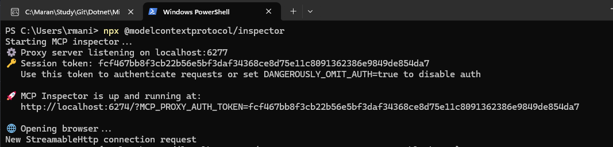
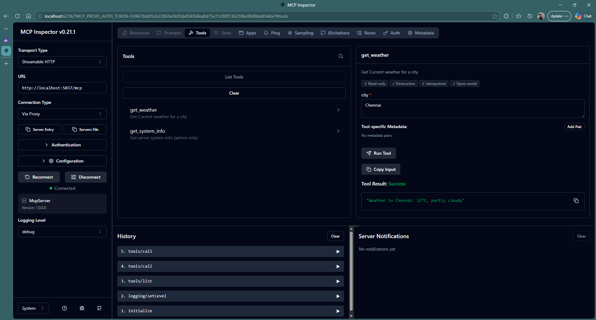
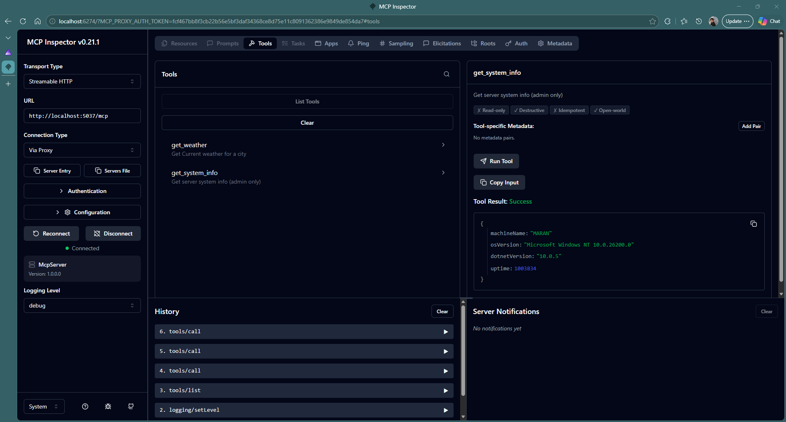
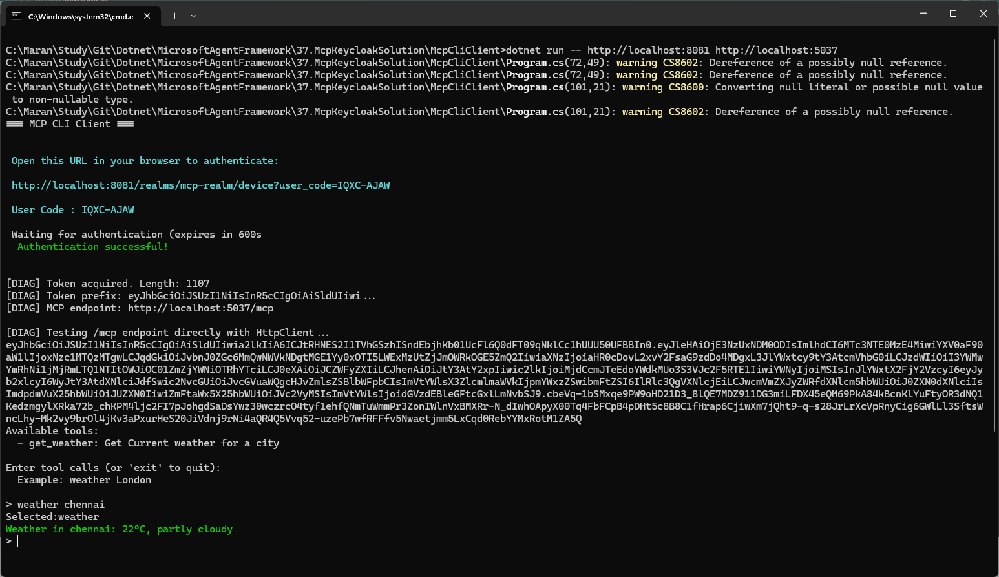
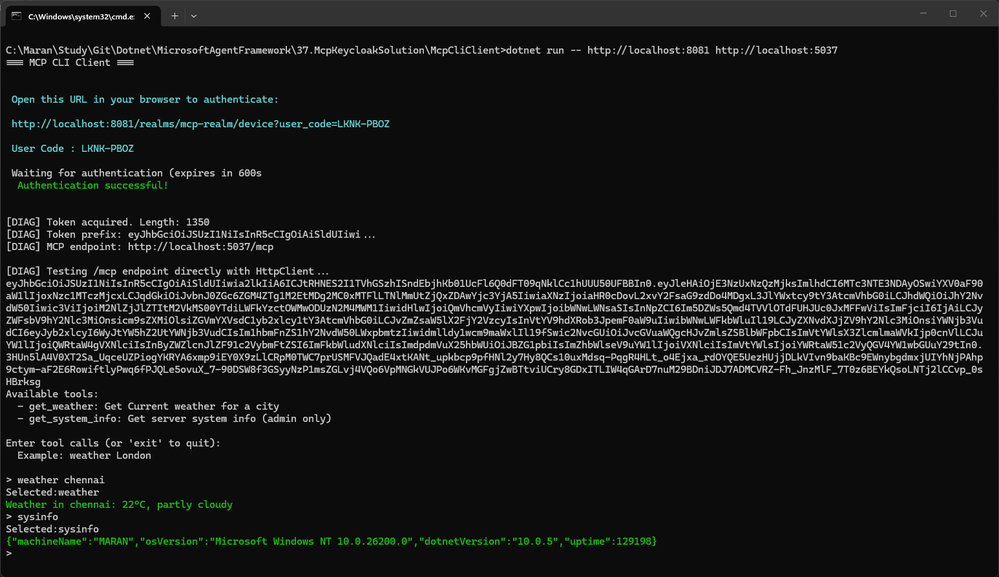
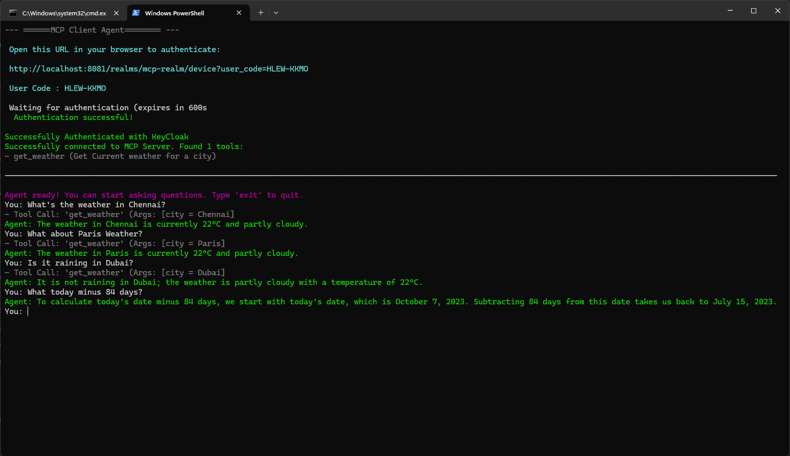
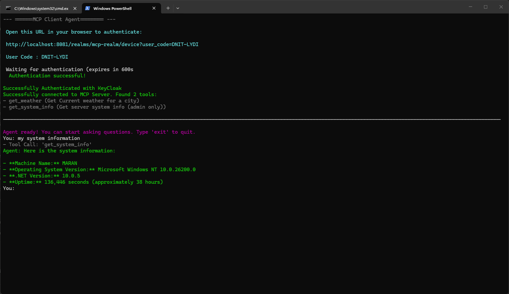
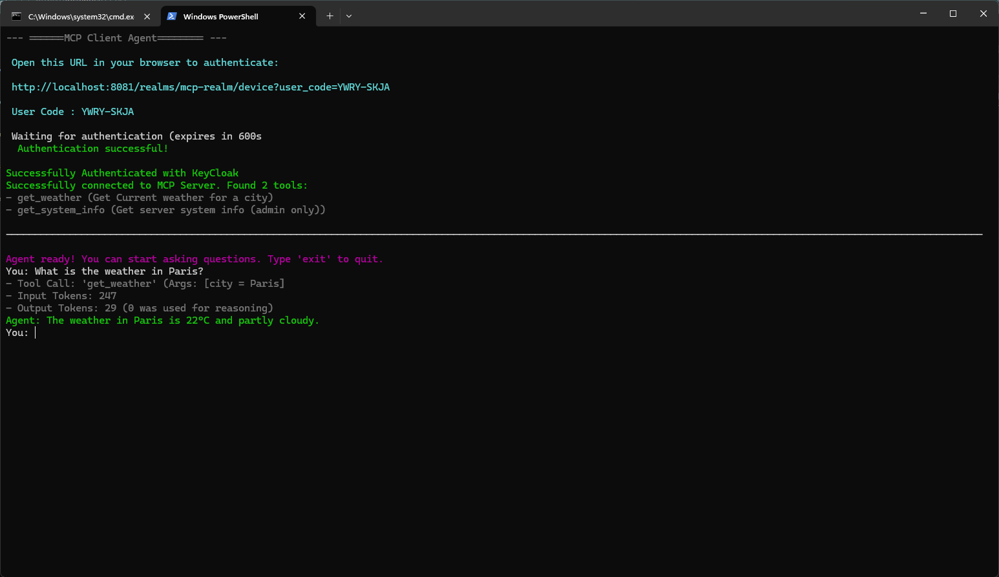

using MCP inspector

```bash
npx @modelcontextprotocol/inspector
```



## Test MCP Tools with Authentication in Inspector





## After Adding Authentication


Token Info:
```json
{
  "exp": 1775143482,
  "iat": 1775143182,
  "auth_time": 1775143180,
  "jti": "onrtdg:2d05ed48-0a5c-1929-a135-f2f9dd8a9fd6",
  "iss": "http://localhost:8081/realms/mcp-realm",
  "sub": "7ac0bda6-c24f-4552-9bb8-5ffcacb94aa7",
  "typ": "Bearer",
  "azp": "mcp-cli",
  "sid": "27BrbSxGhagd1J7KuIsayE15",
  "acr": "1",
  "realm_access": {
    "roles": [
      "mcp-user"
    ]
  },
  "scope": "openid profile email",
  "email_verified": false,
  "name": "Test User1",
  "preferred_username": "testuser",
  "given_name": "Test",
  "family_name": "User1",
  "email": "test@example.com"
}
```
## Accessing from the client with Authentication Bearer token



## Change the Authentication as MCP-Admin


## Using Agent Framework Agent




- Added Token Usage Information

