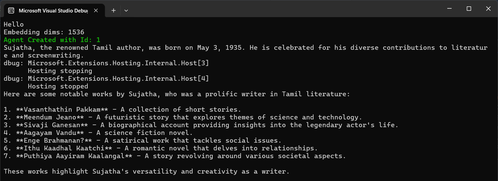
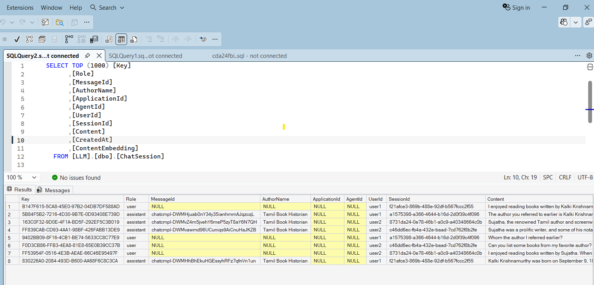

# Agent Chat History in SQL Server

Demonstrates how to persist AI agent chat history to **SQL Server** using `Microsoft.Agents.AI` and `Microsoft.SemanticKernel.Connectors.SqlServer`, with both a console app and a Web API variant.





## Projects

| Project | Type | Purpose |
|---|---|---|
| `AgentApp` | Console App | Standalone demo — runs an agent with SQL Server-backed chat history |
| `AgentAppWebApi` | ASP.NET Core Web API | REST API exposing chat and bookmark endpoints |
| `AppHost` | .NET Aspire Host | Orchestrates `AgentAppWebApi` for local development |
| `ServiceDefaults` | Shared Library | Common Aspire service defaults (telemetry, health checks) |

## How It Works

- Chat history is stored as **vector embeddings** in SQL Server via `SqlServerVectorStore`.
- Each conversation is scoped by `UserId` + `SessionId`.
- On session end (`DisposeAsync`), the in-memory history is flushed to SQL Server.
- A secondary **InMemory** vector store is also demonstrated for comparison.

### AgentApp (Console)

1. Connects to Azure OpenAI (chat + embedding models).
2. Creates a `ChatHistoryMemoryProvider` backed by `SqlServerVectorStore`.
3. Runs two sessions — the second session uses semantic search over stored history to answer context-aware questions.

### AgentAppWebApi (REST API)

| Method | Endpoint | Description |
|---|---|---|
| `POST` | `/chat/message` | Send a message; returns agent reply + session ID |
| `POST` | `/chat/end` | End session and persist history to SQL Server |
| `GET` | `/bookmarks` | List bookmarks for the authenticated user |
| `POST` | `/bookmarks` | Save a Q&A exchange as a bookmark |

All endpoints require authorization (JWT via `sub` claim).

## Configuration

### AgentApp — `appsettings.json` + User Secrets

```json
{
  "AzureAI": {
    "Endpoint": "<azure-openai-endpoint>",
    "ApiKey": "<api-key>",
    "ModelId": "gpt-4o",
    "EmbeddingModelName": "text-embedding-3-small"
  },
  "ConnectionStrings": {
    "DefaultConnection": "Server=localhost,1500;Database=LLM;User ID=sa;Password=<password>;TrustServerCertificate=True"
  }
}
```

### AgentAppWebApi — `appsettings.json`

```json
{
  "AzureOpenAI": {
    "Endpoint": "<azure-openai-endpoint>",
    "ApiKey": "<api-key>",
    "ChatDeployment": "gpt-4o",
    "EmbeddingDeployment": "text-embedding-3-small"
  }
}
```

## Key NuGet Packages

- `Microsoft.Agents.AI` — Agent framework (`ChatClientAgent`, `AgentSession`)
- `Microsoft.SemanticKernel.Connectors.SqlServer` — SQL Server vector store
- `Microsoft.SemanticKernel.Connectors.InMemory` — In-memory vector store
- `Azure.AI.OpenAI` — Azure OpenAI client
- `Microsoft.Extensions.AI` — `IChatClient` abstractions

## Running Locally

**Prerequisites:** SQL Server (or Docker), Azure OpenAI deployment.

```bash
# Start SQL Server via Docker (optional)
docker run -e "ACCEPT_EULA=Y" -e "SA_PASSWORD=MyStrongPassword123!" -p 1500:1433 mcr.microsoft.com/mssql/server

# Run the console demo
cd AgentApp
dotnet run

# Run the Web API via Aspire
cd 41.AgentChatHistoryInSQLServer.AppHost
dotnet run
```
