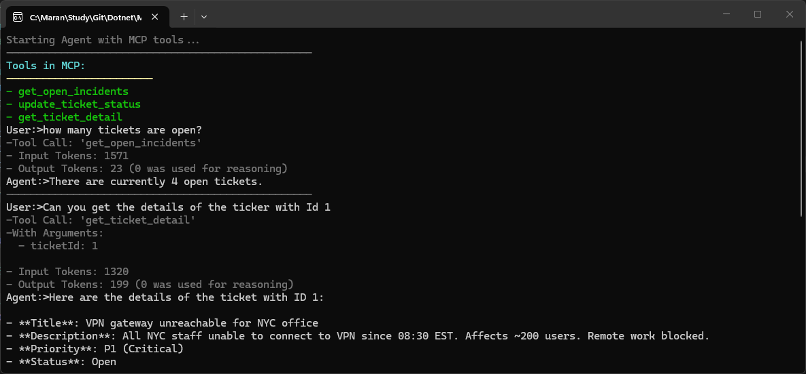

1. Created the MCP server with Tools. Uses Entity Framework to get the ticket details from the database.
2. Created a Microsoft Agent Framework agent and connect directly with the MCP Server.
3. Created MCP Gateway and routed the traffic from Agent to MCP Server.

- Run Agent Connecting directly to the MCP server.
