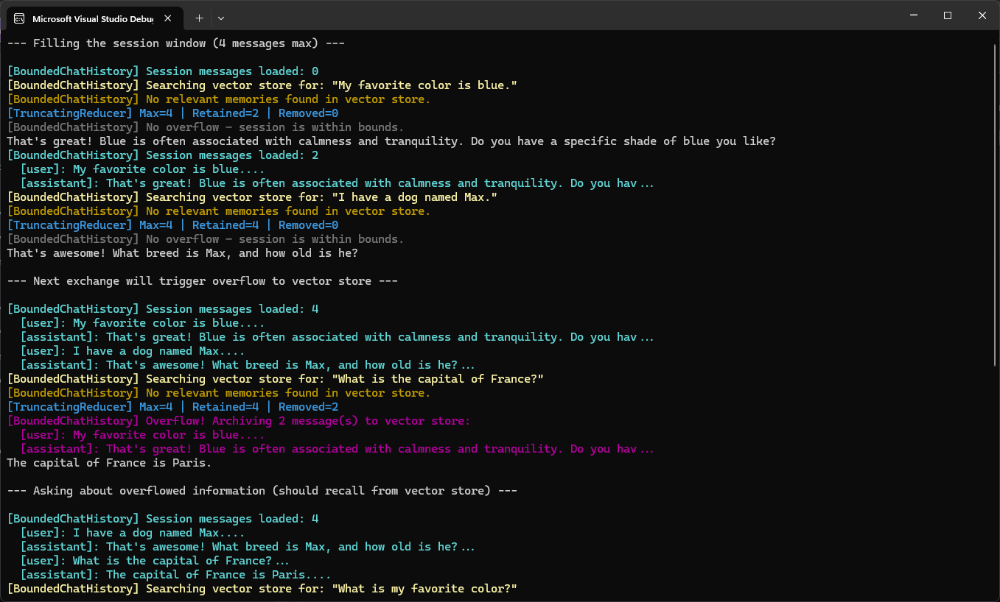
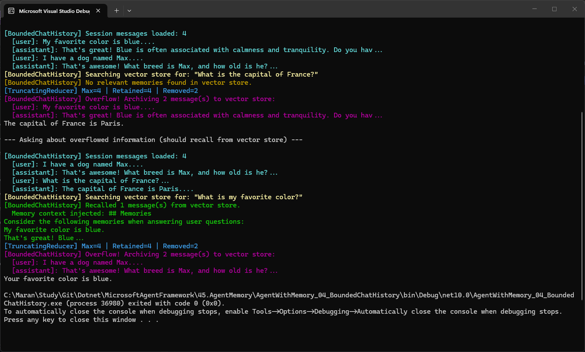
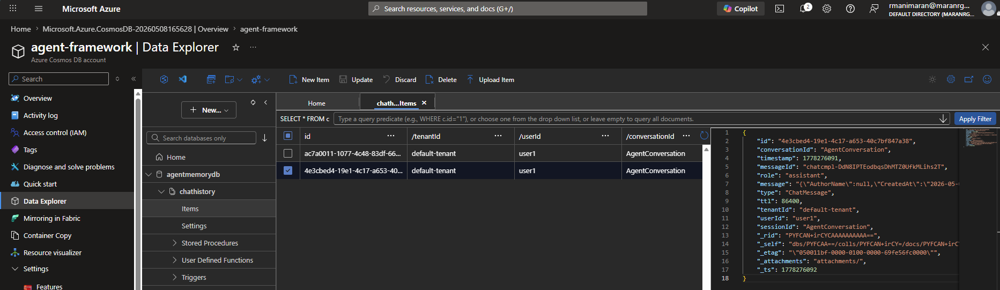
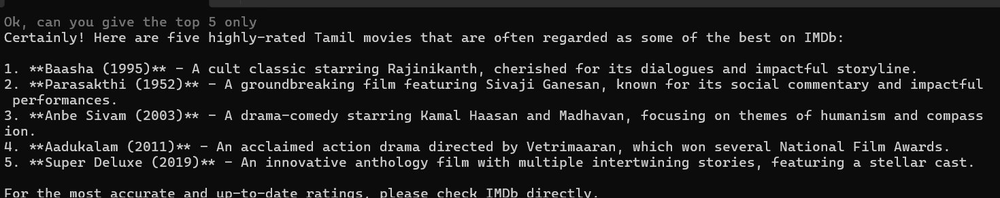
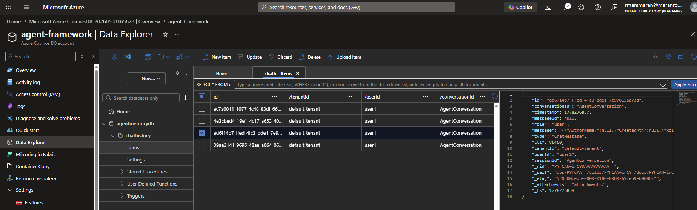

## Agent Memory using Cosmos DB
This sample demonstrates how to use Cosmos DB as a memory store for an agent. The agent will store and retrieve information from Cosmos DB to maintain context across interactions.

