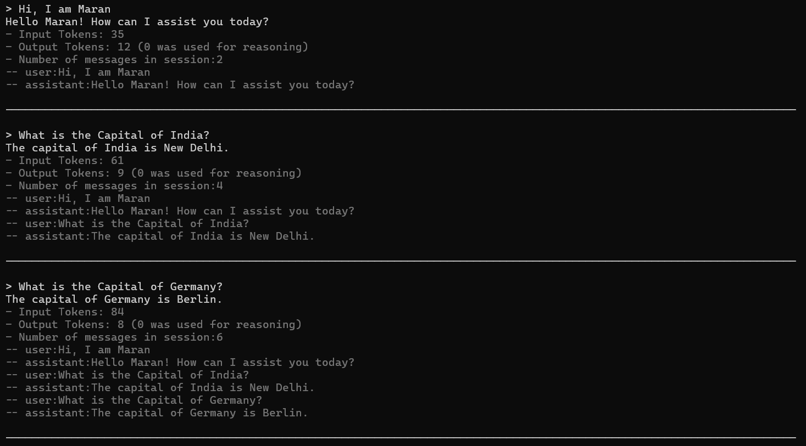
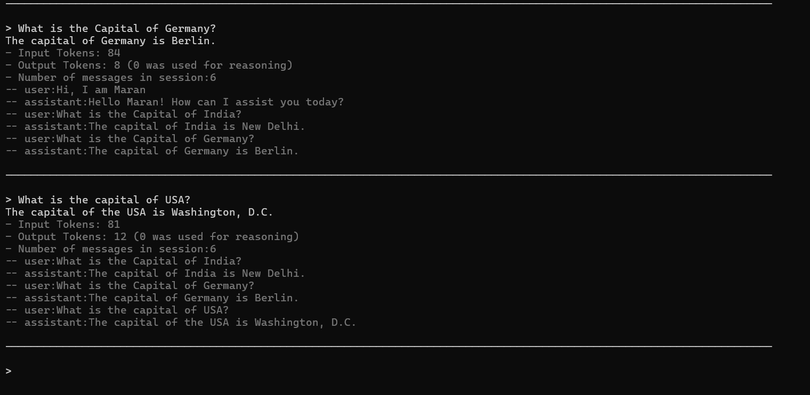
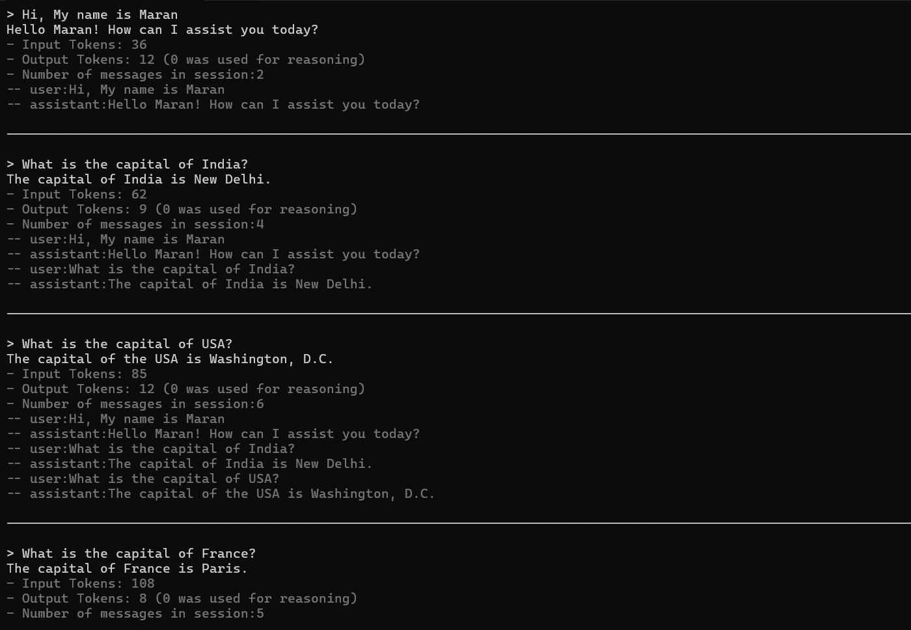
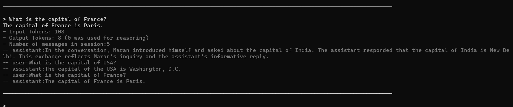
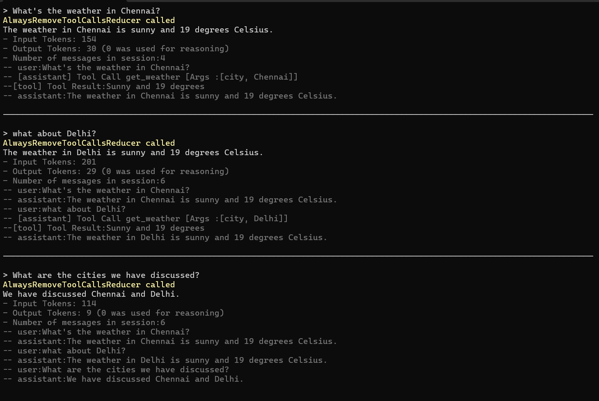
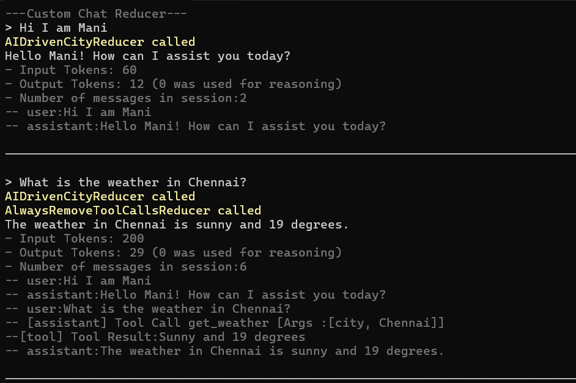
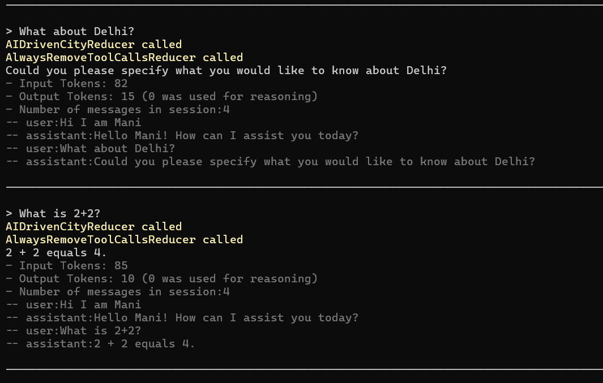
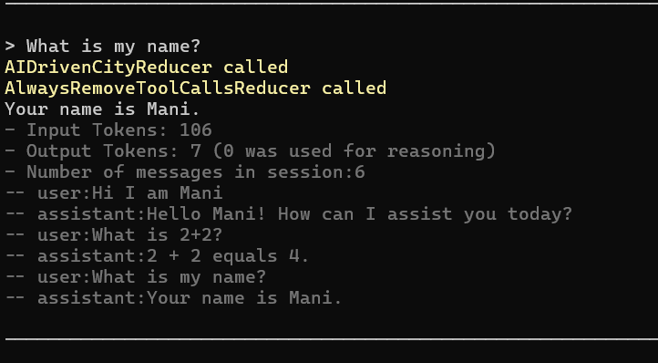

# 48. Chat Reducer

Demonstrates how to use **Chat History Reducers** with the Microsoft Agents AI framework to manage conversation history size and content.

## Overview

As conversations grow, the chat history sent to the LLM increases token usage and can exceed context limits. A `IChatReducer` intercepts the history before each LLM call and trims or transforms it.

## Projects

| Project | Description |
|---|---|
| `AgentApp` | Demonstrates built-in reducers: `MessageCountingChatReducer` and `SummarizingChatReducer` |
| `CustomChatHistoryReducer` | Demonstrates custom reducer implementations |

## Tech Stack

- .NET 10
- Microsoft.Agents.AI `1.3.0`
- Microsoft.Agents.AI.AzureAI `1.0.0-rc5`
- Azure.AI.OpenAI `2.9.0-beta.1`

## Configuration

Both projects use `appsettings.json` and User Secrets for LLM credentials (`Endpoint`, `ApiKey`, `DeploymentOrModelId`).

---

## Built-in Reducers (`AgentApp`)

### MessageCountingChatReducer

Keeps only the last N messages in history. When the count exceeds `targetCount`, older messages are dropped.

```csharp
IChatReducer chatReducer = new MessageCountingChatReducer(targetCount: 4);
```





### SummarizingChatReducer

When history exceeds `threshold`, it uses an LLM to summarize older messages into a single summary message, keeping history within `targetCount`.

```csharp
IChatReducer chatReducer2 = new SummarizingChatReducer(chatClient.AsIChatClient(), targetCount: 1, threshold: 4);
```





---

## Custom Reducers (`CustomChatHistoryReducer`)

### i. AlwaysRemoveToolCallsReducer

Strips all tool-related messages (tool call requests from the assistant and tool result messages) from history on every turn.

```csharp
IChatReducer alwaysRemoveToolCallsReducer = new AlwaysRemoveToolCallsReducer();
```

- Removes messages where `Role == Tool` (tool results)
- Removes assistant messages that contain `FunctionCallContent` (tool requests)



### ii. MessageWithWordReducer

Removes any message containing a specific word (case-insensitive).

```csharp
IChatReducer messageWithWordReducer = new MessageWithWordReducer("Sunny");
```

### iii. AIDrivenCityReducer

Uses a secondary LLM agent to identify and remove messages that mention a city name.

```csharp
ChatClientAgent cityReducerAgent = client.GetChatClient("gpt-4o-mini")
    .AsAIAgent(instructions: "Given the input numbered messages, return the numbers of the messages that contain a city");
IChatReducer aiDrivenCityReducer = new AIDrivenCityReducer(cityReducerAgent);
```

How it works:
1. Strips tool call messages first (reuses `AlwaysRemoveToolCallsReducer`)
2. Formats remaining messages as a numbered list and sends to the reducer agent
3. Agent returns the indexes of city-containing messages
4. Those messages are excluded from the returned history







### iv. AIDrivenPirateSummaryReducer

When history exceeds a threshold, uses a secondary LLM agent to summarize all messages in pirate voice, replacing the entire history with a single summary message.

```csharp
ChatClientAgent pirateSummaryReducerAgent = client.GetChatClient("gpt-4o-mini")
    .AsAIAgent(instructions: "Given the input messages make a summary of them in the voice of a pirate!");
AIDrivenPirateSummaryReducer aIDrivenPirateSummaryReducer = new AIDrivenPirateSummaryReducer(pirateSummaryReducerAgent, 4);
```

---

## Switching Reducers

In `CustomChatHistoryReducer/Program.cs`, swap the active reducer by uncommenting the desired line:

```csharp
ChatHistoryProvider = new InMemoryChatHistoryProvider(new InMemoryChatHistoryProviderOptions
{
    // ChatReducer = alwaysRemoveToolCallsReducer
    // ChatReducer = aIDrivenPirateSummaryReducer
    ChatReducer = aiDrivenCityReducer
})
```
